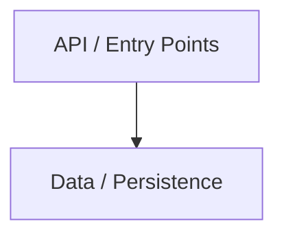
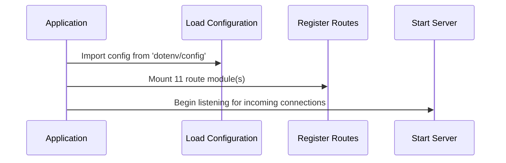
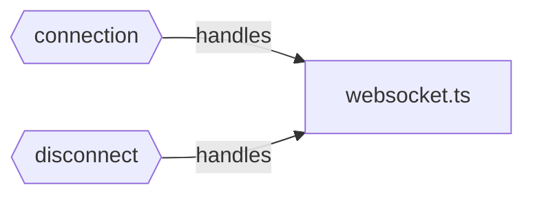
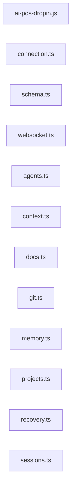
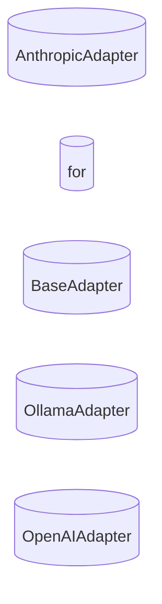

# AI REPOSITORY BRAIN — app

> **FOR AI AGENTS**: This is the SINGLE master intelligence file. Read this FIRST — it replaces 90-98% of full repository scanning.
> **Confidence**: 10% | **Generated**: 2026-05-30T07:44:56.203Z | **Engine**: PGOS AIRB v3.0.0
> **Files Analyzed**: 120 | **LOC**: 17,258 | **Duration**: 952ms
> **README**: > AI-native project runtime, validation, portability, recovery, context, and quality operating system for AI-assisted software development.

---

## TABLE OF CONTENTS

| § | Section | Key Intelligence |
|---|---------|-----------------|
| 1 | Project Identity | Name, stack, domain, maturity, goals |
| 2 | Domain Intelligence | Entities, capabilities, glossary |
| 3 | Architecture | Pattern, layers, boundaries, diagram |
| 4 | Knowledge Graph | Semantic relationship map |
| 5 | Feature Intelligence | Real features, business value |
| 6 | Function Intelligence | Per-function purpose, calls, side effects |
| 7 | Execution Intelligence | Startup, request traces, shutdown |
| 8 | State Intelligence | State owners, mutators, readers |
| 9 | Event Intelligence | Publishers, subscribers, dead events |
| 10 | Dependency Intelligence | Import graph, circulars, SPOFs |
| 11 | API & Contracts | Routes, auth, trust boundaries |
| 12 | Data Intelligence | Models, migrations, data flows |
| 13 | Configuration | Env vars, secrets, unsafe defaults |
| 14 | Test Intelligence | Coverage map, risk-based matrix |
| 15 | Change Impact Engine | Blast radius, affected features |
| 16 | Risk Intelligence | Risk scores, SPOFs, critical paths |
| 17 | Performance | Hot paths, bottlenecks, async coverage |
| 18 | Observability | Logging, metrics, blind spots |
| 19 | Security | Auth, secrets, trust boundaries |
| 20 | Technical Debt | TODOs, dead code, effort estimate |
| 21 | Project Memory | Decisions, evolution, active work |
| 22 | AI Operating System | ALWAYS / NEVER / BEFORE / AFTER |
| 23 | AI Navigation Engine | Task-based section routing |
| 24 | Token Compression | L0-L6 semantic compression |
| 25 | False Generation Prevention | Stub & drift detection |
| 26 | Validation Engine | Confidence, staleness, checks |
| 27 | Visualization Engine | Mermaid diagram index |
| 28 | Adoption & Usability | Onboarding, CI/CD, usage guide |

---

## §1 — PROJECT IDENTITY

| Attribute | Value |
|-----------|-------|
| **Name** | app |
| **Type** | Monorepo |
| **Domain** | Analytics |
| **Primary Language** | TypeScript |
| **Framework** | React |
| **Architecture** | Monorepo |
| **Maturity** | Growth |
| **Scale** | 120 files · 17,258 LOC |
| **Languages** | TypeScript (15449), JavaScript (1809) |
| **Classes** | 60 |
| **Functions** | 348 |
| **API Endpoints** | 93 |
| **Risk Score** | 23/100 |
| **Confidence** | 10% |

### Executive Summary
app is a growth-grade TypeScript React application using Monorepo architecture. It contains 348 functions across 120 files with 93 API endpoints. The system implements 24 business feature(s) in the Analytics domain. Risk: 23/100. Confidence: 10%.

### Business Purpose
> AI-native project runtime, validation, portability, recovery, context, and quality operating system for AI-assisted software development.

---

## §2 — DOMAIN INTELLIGENCE

### Domain Entities (167)
| Entity | Type | File |
|--------|------|------|
| **Agent** | Interface | `packages/core/src/types/agent.ts` |
| **AgentConfig** | Interface | `packages/core/src/types/agent.ts` |
| **AgentTask** | Interface | `packages/core/src/types/agent.ts` |
| **AgentTaskInput** | Interface | `packages/core/src/types/agent.ts` |
| **AgentTaskOutput** | Interface | `packages/core/src/types/agent.ts` |
| **AgentFileChange** | Interface | `packages/core/src/types/agent.ts` |
| **AgentPipeline** | Interface | `packages/core/src/types/agent.ts` |
| **AgentStage** | Interface | `packages/core/src/types/agent.ts` |
| **AgentMemory** | Interface | `packages/core/src/types/agent.ts` |
| **ProjectIdentity** | Interface | `packages/core/src/types/ai-pos-types.ts` |
| **DomainModel** | Interface | `packages/core/src/types/ai-pos-types.ts` |
| **DomainEntity** | Interface | `packages/core/src/types/ai-pos-types.ts` |
| **DomainRelation** | Interface | `packages/core/src/types/ai-pos-types.ts` |
| **DomainLifecycle** | Interface | `packages/core/src/types/ai-pos-types.ts` |
| **GlossaryEntry** | Interface | `packages/core/src/types/ai-pos-types.ts` |
| **ArchitectureIntelligence** | Interface | `packages/core/src/types/ai-pos-types.ts` |
| **ArchitectureLayerDetail** | Interface | `packages/core/src/types/ai-pos-types.ts` |
| **CommunicationPattern** | Interface | `packages/core/src/types/ai-pos-types.ts` |
| **BoundaryDefinition** | Interface | `packages/core/src/types/ai-pos-types.ts` |
| **ExecutionFlows** | Interface | `packages/core/src/types/ai-pos-types.ts` |

### Domain Glossary
- **Dirs**: Business entity inferred from findDirs
- **Intelligence**: Business entity inferred from validateIntelligence
- **ScoreLabel**: Business entity inferred from getScoreLabel
- **Trace**: Business entity inferred from getTrace
- **AgentIds**: Business entity inferred from getAgentIds
- **Architecture**: Business entity inferred from validateArchitecture
- **App**: Business entity inferred from createApp
- **Users**: Business entity inferred from getUsers
- **User**: Business entity inferred from createUser
- **UserService**: Business entity inferred from getUserService
- **All**: Business entity inferred from findAll
- **ById**: Business entity inferred from findById
- **Db**: Business entity inferred from getDb
- **LineOfNode**: Business entity inferred from getLineOfNode
- **Codebase**: Business entity inferred from validateCodebase
- **Agent**: Contract/interface: Agent
- **AgentConfig**: Contract/interface: AgentConfig
- **AgentTask**: Contract/interface: AgentTask
- **AgentTaskInput**: Contract/interface: AgentTaskInput
- **AgentTaskOutput**: Contract/interface: AgentTaskOutput

### Business Capabilities
- **Path**: 6 endpoint(s) [GET, POST, /PATH]
- **Agents**: 4 endpoint(s) [POST, GET]
- **Context**: 6 endpoint(s) [GET, POST]
- **Docs**: 4 endpoint(s) [POST, GET]
- **Git**: 6 endpoint(s) [POST, GET]
- **Memory**: 4 endpoint(s) [POST, GET]
- **Root**: 4 endpoint(s) [GET, POST]
- **:id**: 10 endpoint(s) [GET, PUT, DELETE]
- **Ingest**: 2 endpoint(s) [POST]
- **Health**: 6 endpoint(s) [GET]
- **Recovery**: 4 endpoint(s) [POST, GET]
- **Sessions**: 4 endpoint(s) [POST]
- **Snapshots**: 6 endpoint(s) [POST, GET]
- **Metrics**: 2 endpoint(s) [GET]
- **Info**: 2 endpoint(s) [GET]
- **Validate**: 8 endpoint(s) [POST]
- **L0**: 4 endpoint(s) [GET]
- **Users**: 6 endpoint(s) [GET, POST]
- **Auth**: 4 endpoint(s) [POST]
- **KEY**: 1 endpoint(s) [GET]

### Business Processes
- `findDirs()` in `ai-pos-dropin.js`
- `validateIntelligence()` in `ai-pos-dropin.js`
- `getScoreLabel()` in `apps/cli/src/commands/validate.ts`
- `getTrace()` in `packages/agent-runtime/src/index.ts`
- `getAgentIds()` in `packages/agent-runtime/src/index.ts`
- `validateArchitecture()` in `packages/architecture-guard/src/index.ts`
- `createApp()` in `packages/context-engine/src/__tests__/analyzers.test.ts`
- `getUsers()` in `packages/context-engine/src/__tests__/analyzers.test.ts`
- `createUser()` in `packages/context-engine/src/__tests__/analyzers.test.ts`
- `updateUser()` in `packages/context-engine/src/__tests__/analyzers.test.ts`
- `deleteUser()` in `packages/context-engine/src/__tests__/analyzers.test.ts`
- `getUserService()` in `packages/context-engine/src/__tests__/analyzers.test.ts`
- `findAll()` in `packages/context-engine/src/__tests__/analyzers.test.ts`
- `findById()` in `packages/context-engine/src/__tests__/analyzers.test.ts`
- `getDb()` in `packages/context-engine/src/__tests__/context.test.ts`

### Entity Relationships
- AnthropicAdapter —[extends]→ BaseAdapter
- BaseAdapter —[implements]→ ModelAdapter
- OllamaAdapter —[extends]→ BaseAdapter
- OpenAIAdapter —[extends]→ BaseAdapter

---

## §3 — ARCHITECTURE INTELLIGENCE

**Detected Pattern**: `Monorepo` (35% confidence)

### Architecture Narrative
This system uses Monorepo architecture built on React. It is organized into 2 distinct layers.

### Evidence
- Multi-package workspace structure
- Plugin/extension architecture
- React framework detected from imports

### Layer Map
| Layer | Purpose | Directories |
|-------|---------|-------------|
| **API / Entry Points** | HTTP request handling and routing | `apps/api, apps/api/src/routes` |
| **Data / Persistence** | Data access and storage operations | `apps/api/src/db` |

### Architecture Diagram


---

## §4 — REPOSITORY KNOWLEDGE GRAPH

| Metric | Count |
|--------|-------|
| Modules | 56 |
| Features | 24 |
| Entities | 20 |
| API Nodes | 0 |
| Relationships | 28 |

### Knowledge Graph Diagram


---

## §5 — FEATURE INTELLIGENCE

| Feature | Status | Business Value | Files | Tests | Coverage | Risk |
|---------|--------|----------------|-------|-------|----------|------|
| **Path** | partial | high | 1 | 0 | 73% | medium |
| **Agents** | implemented | high | 1 | 0 | 100% | high |
| **Context** | implemented | high | 1 | 0 | 100% | high |
| **Docs** | implemented | high | 1 | 0 | 100% | high |
| **Git** | implemented | high | 1 | 0 | 100% | high |
| **Memory** | implemented | high | 1 | 0 | 100% | high |
| **Root** | implemented | high | 1 | 0 | 100% | high |
| **:id** | implemented | high | 2 | 0 | 100% | high |
| **Ingest** | implemented | medium | 1 | 0 | 100% | high |
| **Health** | implemented | high | 3 | 0 | 100% | high |
| **Recovery** | implemented | high | 1 | 0 | 100% | high |
| **Sessions** | implemented | high | 1 | 0 | 100% | high |
| **Snapshots** | implemented | high | 1 | 0 | 100% | high |
| **Metrics** | implemented | medium | 1 | 0 | 100% | high |
| **Info** | implemented | medium | 1 | 0 | 100% | high |
| **Validate** | implemented | high | 1 | 0 | 100% | high |
| **L0** | partial | high | 3 | 0 | 84% | high |
| **Users** | implemented | high | 2 | 0 | 89% | medium |
| **Auth** | implemented | high | 2 | 0 | 67% | medium |
| **KEY** | implemented | medium | 1 | 0 | 100% | medium |
| **AnthropicAdapter** | implemented | medium | 1 | 0 | 100% | low |
| **for** | implemented | medium | 1 | 0 | 100% | low |
| **OllamaAdapter** | implemented | medium | 1 | 0 | 100% | low |
| **OpenAIAdapter** | implemented | medium | 1 | 0 | 100% | low |

### Path
- **Purpose**: Handles path operations via 6 endpoint(s)
- **Entrypoints**: `GET /path`, `GET /path`, `POST /path`, `/PATH /path`, `GET /path`
- **Status**: partial | **Coverage**: 73%

### Agents
- **Purpose**: Handles agents operations via 4 endpoint(s)
- **Entrypoints**: `POST /:id/agents/run`, `GET /:id/agents/tasks`, `POST /:id/agents/run`, `GET /:id/agents/tasks`
- **Status**: implemented | **Coverage**: 100%

### Context
- **Purpose**: Handles context operations via 6 endpoint(s)
- **Entrypoints**: `GET /:id/context`, `POST /:id/context/compile`, `POST /:id/context/export`, `GET /:id/context`, `POST /:id/context/compile`
- **Status**: implemented | **Coverage**: 100%

### Docs
- **Purpose**: Handles docs operations via 4 endpoint(s)
- **Entrypoints**: `POST /:id/docs/compile`, `GET /:id/docs/coverage`, `POST /:id/docs/compile`, `GET /:id/docs/coverage`
- **Status**: implemented | **Coverage**: 100%

### Git
- **Purpose**: Handles git operations via 6 endpoint(s)
- **Entrypoints**: `POST /:id/git/commit`, `GET /:id/git/diff`, `GET /:id/git/history`, `POST /:id/git/commit`, `GET /:id/git/diff`
- **Status**: implemented | **Coverage**: 100%

### Memory
- **Purpose**: Handles memory operations via 4 endpoint(s)
- **Entrypoints**: `POST /:id/memory`, `GET /:id/memory`, `POST /:id/memory`, `GET /:id/memory`
- **Status**: implemented | **Coverage**: 100%

### Root
- **Purpose**: Handles root operations via 4 endpoint(s)
- **Entrypoints**: `GET /`, `POST /`, `GET /`, `POST /`
- **Status**: implemented | **Coverage**: 100%

### :id
- **Purpose**: Handles :id operations via 10 endpoint(s)
- **Entrypoints**: `GET /:id`, `PUT /:id`, `DELETE /:id`, `GET /:id`, `PUT /:id`
- **Status**: implemented | **Coverage**: 100%

### Ingest
- **Purpose**: Handles ingest operations via 2 endpoint(s)
- **Entrypoints**: `POST /:id/ingest`, `POST /:id/ingest`
- **Status**: implemented | **Coverage**: 100%

### Health
- **Purpose**: Handles health operations via 6 endpoint(s)
- **Entrypoints**: `GET /:id/health`, `GET /:id/health`, `GET /health`, `GET /health`, `GET /health`
- **Status**: implemented | **Coverage**: 100%


---

## §6 — FUNCTION INTELLIGENCE

> Top 50 functions ranked by importance (cross-module calls, exports, handler status)

### `runAllAnalyzers()` — pure
- **Purpose**: run all analyzers
- **File**: `packages/context-engine/src/analyzers/index.ts` L43
- **Params**: mockRoot, files, depGraph, modules
- **Async**: Yes | **Exported**: Yes

### `inferArchitecture()` — middleware
- **Purpose**: infer architecture
- **File**: `packages/architecture-guard/src/index.ts` L48
- **Params**: rootPath
- **Async**: Yes | **Exported**: Yes

### `validateArchitecture()` — middleware
- **Purpose**: Validates architecture
- **File**: `packages/architecture-guard/src/index.ts` L93
- **Params**: rootPath, baseline
- **Async**: Yes | **Exported**: Yes

### `detectHallucinations()` — pure
- **Purpose**: detect hallucinations
- **File**: `packages/hallucination-detector/src/index.ts` L23
- **Params**: rootPath
- **Async**: Yes | **Exported**: Yes

### `semanticCommit()` — pure
- **Purpose**: semantic commit
- **File**: `packages/semantic-git/src/index.ts` L29
- **Params**: rootPath, message, options
- **Async**: Yes | **Exported**: Yes

### `semanticDiff()` — pure
- **Purpose**: semantic diff
- **File**: `packages/semantic-git/src/index.ts` L78
- **Params**: rootPath, fromCommit?, toCommit?
- **Async**: Yes | **Exported**: Yes

### `registerContextCommand()` — utility
- **Purpose**: Creates context command
- **File**: `apps/cli/src/commands/context.ts` L14
- **Params**: program
- **Side Effects**: HTTP calls
- **Async**: No | **Exported**: Yes

### `registerDocsCommand()` — pure
- **Purpose**: Creates docs command
- **File**: `apps/cli/src/commands/docs.ts` L6
- **Params**: program
- **Async**: No | **Exported**: Yes

### `registerInitCommand()` — pure
- **Purpose**: Creates init command
- **File**: `apps/cli/src/commands/init.ts` L13
- **Params**: program
- **Async**: No | **Exported**: Yes

### `registerRecoveryCommand()` — pure
- **Purpose**: Creates recovery command
- **File**: `apps/cli/src/commands/recovery.ts` L6
- **Params**: program
- **Async**: No | **Exported**: Yes

### `registerReportCommand()` — pure
- **Purpose**: Creates report command
- **File**: `apps/cli/src/commands/report.ts` L16
- **Params**: program
- **Async**: No | **Exported**: Yes

### `registerSnapshotCommand()` — pure
- **Purpose**: Creates snapshot command
- **File**: `apps/cli/src/commands/snapshot.ts` L12
- **Params**: program
- **Async**: No | **Exported**: Yes

### `registerStatusCommand()` — pure
- **Purpose**: Creates status command
- **File**: `apps/cli/src/commands/status.ts` L12
- **Params**: program
- **Async**: No | **Exported**: Yes

### `registerValidateCommand()` — pure
- **Purpose**: Creates validate command
- **File**: `apps/cli/src/commands/validate.ts` L16
- **Params**: program
- **Async**: No | **Exported**: Yes

### `ArchitecturePage()` — pure
- **Purpose**: architecture page
- **File**: `apps/dashboard/src/app/architecture/page.tsx` L10
- **Async**: No | **Exported**: Yes

### `DocsPage()` — pure
- **Purpose**: docs page
- **File**: `apps/dashboard/src/app/docs/page.tsx` L10
- **Async**: No | **Exported**: Yes

### `RootLayout()` — pure
- **Purpose**: root layout
- **File**: `apps/dashboard/src/app/layout.tsx` L10
- **Params**: {, }
- **Async**: No | **Exported**: Yes

### `MemoryBrowserPage()` — pure
- **Purpose**: memory browser page
- **File**: `apps/dashboard/src/app/memory/page.tsx` L10
- **Async**: No | **Exported**: Yes

### `DashboardPage()` — pure
- **Purpose**: dashboard page
- **File**: `apps/dashboard/src/app/page.tsx` L5
- **Async**: No | **Exported**: Yes

### `ValidationPage()` — pure
- **Purpose**: validation page
- **File**: `apps/dashboard/src/app/validation/page.tsx` L10
- **Async**: No | **Exported**: Yes

### `listFilesRecursive()` — pure
- **Purpose**: list files recursive
- **File**: `apps/dashboard/src/app/validation/page.tsx` L41
- **Async**: No | **Exported**: Yes

### `extractDomainModel()` — pure
- **Purpose**: extract domain model
- **File**: `packages/context-engine/src/analyzers/domain-extractor.ts` L9
- **Params**: mockRoot, files
- **Async**: No | **Exported**: Yes

### `createAdapter()` — pure
- **Purpose**: Creates adapter
- **File**: `packages/model-adapters/src/index.ts` L16
- **Params**: config
- **Async**: No | **Exported**: Yes

### `getSupportedProviders()` — pure
- **Purpose**: Retrieves supported providers
- **File**: `packages/model-adapters/src/index.ts` L63
- **Async**: No | **Exported**: Yes

### `validateConfig()` — pure
- **Purpose**: Validates config
- **File**: `packages/model-adapters/src/index.ts` L78
- **Params**: config
- **Async**: No | **Exported**: Yes

### `analyzeTokenUsage()` — pure
- **Purpose**: analyze token usage
- **File**: `packages/token-optimizer/src/index.ts` L30
- **Params**: contents, string>
- **Async**: No | **Exported**: Yes

### `compressContext()` — pure
- **Purpose**: compress context
- **File**: `packages/token-optimizer/src/index.ts` L51
- **Params**: content, maxTokens, strategy
- **Async**: No | **Exported**: Yes

### `createBudget()` — pure
- **Purpose**: Creates budget
- **File**: `packages/token-optimizer/src/index.ts` L105
- **Params**: totalTokens, allocations, number>
- **Async**: No | **Exported**: Yes

### `checkBudget()` — pure
- **Purpose**: Validates budget
- **File**: `packages/token-optimizer/src/index.ts` L126
- **Params**: budget, section, content
- **Async**: No | **Exported**: Yes

### `generateMultiLevelSummary()` — pure
- **Purpose**: generate multi level summary
- **File**: `packages/token-optimizer/src/index.ts` L143
- **Params**: intel, level
- **Async**: No | **Exported**: Yes


---

## §7 — EXECUTION INTELLIGENCE

### Startup Flow
1. **Load Configuration** — Import config from 'dotenv/config'; (`apps/api/src/server.ts`)
2. **Register Routes** — Mount 11 route module(s) (`apps/api/src/server.ts`)
3. **Start Server** — Begin listening for incoming connections (`apps/api/src/server.ts`)

### Request Processing Flow
1. **Run Middleware Chain** — Execute 1 middleware(s): index.ts
2. **Authenticate & Authorize** — Validate credentials and permissions
3. **Validate Input** — Schema validation and sanitization
4. **Execute Business Logic** — Route to appropriate service handler
5. **Persist / Fetch Data** — Database read/write operations
6. **Send Response** — Serialize and return response to client

### Shutdown Flow
- **Graceful Shutdown** — Handle SIGTERM/SIGINT, close connections, drain queues

### Startup Sequence Diagram


---

## §8 — STATE INTELLIGENCE

### State Mutators (10 files)
- `ai-pos-dropin.js` — Modifies application state
- `packages/agent-runtime/src/index.ts` — Modifies application state
- `packages/context-engine/src/__tests__/analyzers.test.ts` — Modifies application state
- `packages/context-engine/src/parser/ast-parser.ts` — Modifies application state
- `packages/core/src/errors/index.ts` — Modifies application state
- `packages/model-adapters/src/anthropic/adapter.ts` — Modifies application state
- `packages/model-adapters/src/base/adapter.ts` — Modifies application state
- `packages/model-adapters/src/ollama/adapter.ts` — Modifies application state
- `packages/model-adapters/src/openai/adapter.ts` — Modifies application state
- `packages/observability/src/index.ts` — Modifies application state

### State Readers (17 files)
- `ai-pos-dropin.js` — Reads application state
- `packages/agent-runtime/src/index.ts` — Reads application state
- `packages/context-engine/src/__tests__/analyzers.test.ts` — Reads application state
- `packages/context-engine/src/__tests__/validator.test.ts` — Reads application state
- `packages/context-engine/src/parser/ast-parser.ts` — Reads application state
- `packages/core/src/errors/index.ts` — Reads application state
- `packages/doc-engine/src/index.ts` — Reads application state
- `packages/doc-engine/src/reports/report-generator.ts` — Reads application state
- `packages/doc-engine/src/reports/savings-calculator.ts` — Reads application state
- `packages/memory-engine/src/index.ts` — Reads application state

---

## §9 — EVENT INTELLIGENCE

### Publishers (0)
- No event emissions detected

### Subscribers (2)
- `connection` handled in `apps/api/src/plugins/websocket.ts`
- `disconnect` handled in `apps/api/src/plugins/websocket.ts`

### Unhandled Events (listened but never emitted)
- `connection`
- `disconnect`

### Event Flow Diagram


---

## §10 — DEPENDENCY INTELLIGENCE

- **Modules**: 120 | **Edges**: 0 | **Circular**: 0

### Single Points of Failure
- None identified

### External Dependencies (54)
- **{** — 87 file(s)
- **path** — 46 file(s)
- **type** — 43 file(s)
- **fs** — 36 file(s)
- **@pgos/core** — 36 file(s)
- **vitest** — 18 file(s)
- **url** — 12 file(s)
- **chalk** — 9 file(s)
- **@pgos/context-engine** — 5 file(s)
- **@pgos/recovery-engine** — 5 file(s)
- **ora** — 4 file(s)
- **commander** — 4 file(s)
- **React,** — 4 file(s)
- **drizzle-orm** — 3 file(s)
- **postgres** — 3 file(s)

### Dependency Graph


---

## §11 — API & CONTRACT INTELLIGENCE

### Endpoints (93)
| Method | Path | File | Line |
|--------|------|------|------|
| `GET` | `/path` | `ai-pos-dropin.js` | 212 |
| `GET` | `/path` | `ai-pos-dropin.js` | 214 |
| `POST` | `/path` | `ai-pos-dropin.js` | 214 |
| `/PATH` | `/path` | `ai-pos-dropin.js` | 216 |
| `GET` | `/path` | `ai-pos-dropin.js` | 212 |
| `GET` | `/path` | `ai-pos-dropin.js` | 218 |
| `POST` | `/:id/agents/run` | `apps/api/src/routes/agents.ts` | 12 |
| `GET` | `/:id/agents/tasks` | `apps/api/src/routes/agents.ts` | 47 |
| `POST` | `/:id/agents/run` | `apps/api/src/routes/agents.ts` | 12 |
| `GET` | `/:id/agents/tasks` | `apps/api/src/routes/agents.ts` | 47 |
| `GET` | `/:id/context` | `apps/api/src/routes/context.ts` | 10 |
| `POST` | `/:id/context/compile` | `apps/api/src/routes/context.ts` | 25 |
| `POST` | `/:id/context/export` | `apps/api/src/routes/context.ts` | 67 |
| `GET` | `/:id/context` | `apps/api/src/routes/context.ts` | 10 |
| `POST` | `/:id/context/compile` | `apps/api/src/routes/context.ts` | 25 |
| `POST` | `/:id/context/export` | `apps/api/src/routes/context.ts` | 67 |
| `POST` | `/:id/docs/compile` | `apps/api/src/routes/docs.ts` | 10 |
| `GET` | `/:id/docs/coverage` | `apps/api/src/routes/docs.ts` | 44 |
| `POST` | `/:id/docs/compile` | `apps/api/src/routes/docs.ts` | 10 |
| `GET` | `/:id/docs/coverage` | `apps/api/src/routes/docs.ts` | 44 |
| `POST` | `/:id/git/commit` | `apps/api/src/routes/git.ts` | 10 |
| `GET` | `/:id/git/diff` | `apps/api/src/routes/git.ts` | 36 |
| `GET` | `/:id/git/history` | `apps/api/src/routes/git.ts` | 54 |
| `POST` | `/:id/git/commit` | `apps/api/src/routes/git.ts` | 10 |
| `GET` | `/:id/git/diff` | `apps/api/src/routes/git.ts` | 36 |
| `GET` | `/:id/git/history` | `apps/api/src/routes/git.ts` | 54 |
| `POST` | `/:id/memory` | `apps/api/src/routes/memory.ts` | 11 |
| `GET` | `/:id/memory` | `apps/api/src/routes/memory.ts` | 29 |
| `POST` | `/:id/memory` | `apps/api/src/routes/memory.ts` | 11 |
| `GET` | `/:id/memory` | `apps/api/src/routes/memory.ts` | 29 |

### Authentication: Custom Auth, JWT
### Trust Boundaries: `packages/architecture-guard/src/index.ts`

---

## §12 — DATA INTELLIGENCE

### Database Models (6)
| Model | ORM | File |
|-------|-----|------|
| **AnthropicAdapter** | Custom | `packages/model-adapters/src/anthropic/adapter.ts` |
| **for** | Custom | `packages/model-adapters/src/base/adapter.ts` |
| **for** | Custom | `packages/model-adapters/src/base/adapter.ts` |
| **BaseAdapter** | Custom | `packages/model-adapters/src/base/adapter.ts` |
| **OllamaAdapter** | Custom | `packages/model-adapters/src/ollama/adapter.ts` |
| **OpenAIAdapter** | Custom | `packages/model-adapters/src/openai/adapter.ts` |

### Data Flow Diagram


---

## §13 — CONFIGURATION INTELLIGENCE

### Environment Variables (14)
| Variable | Sensitive | Used In |
|----------|-----------|---------|
| `DATABASE_URL` | No | `packages/context-engine/src/__tests__/test-standalone.js` |
| `DASHBOARD_URL` | No | `apps/api/src/server.ts` |
| `API_LOG_LEVEL` | No | `packages/core/src/utils/logger.ts` |
| `NODE_ENV` | No | `packages/core/src/utils/logger.ts` |
| `RATE_LIMIT_MAX` | No | `apps/api/src/server.ts` |
| `RATE_LIMIT_WINDOW_MS` | No | `apps/api/src/server.ts` |
| `API_PORT` | No | `apps/api/src/server.ts` |
| `API_HOST` | No | `apps/api/src/server.ts` |
| `NEXT_PUBLIC_API_URL` | No | `apps/dashboard/next.config.mjs` |
| `JWT_SECRET` | **YES** | `packages/context-engine/src/__tests__/analyzers.test.ts` |
| `LOG_LEVEL` | No | `packages/context-engine/src/__tests__/analyzers.test.ts` |
| `VITEST` | No | `packages/core/src/utils/logger.ts` |
| `get` | No | `packages/hallucination-detector/src/index.ts` |
| `KEY` | **YES** | `packages/hallucination-detector/src/index.ts` |

---

## §14 — TEST INTELLIGENCE

| Metric | Value |
|--------|-------|
| **Test Files** | 33 |
| **Tested Modules** | 0 |
| **Untested Source Files** | 87 |
| **Test Ratio** | 28% |

### Critical Untested Paths
- `apps/api/src/db/connection.ts` — Critical file with no test coverage
- `apps/api/src/db/schema.ts` — Critical file with no test coverage
- `apps/api/src/plugins/websocket.ts` — Critical file with no test coverage
- `apps/api/src/routes/agents.ts` — Critical file with no test coverage
- `apps/api/src/routes/docs.ts` — Critical file with no test coverage
- `apps/api/src/routes/git.ts` — Critical file with no test coverage
- `apps/api/src/routes/memory.ts` — Critical file with no test coverage
- `apps/api/src/routes/projects.ts` — Critical file with no test coverage
- `apps/api/src/routes/sessions.ts` — Critical file with no test coverage
- `apps/api/src/routes/snapshots.ts` — Critical file with no test coverage

### Feature → Test Map
- **Path**: No tests
- **Agents**: No tests
- **Context**: No tests
- **Docs**: No tests
- **Git**: No tests
- **Memory**: No tests
- **Root**: No tests
- **:id**: No tests
- **Ingest**: No tests
- **Health**: No tests
- **Recovery**: No tests
- **Sessions**: No tests
- **Snapshots**: No tests
- **Metrics**: No tests
- **Info**: No tests

---

## §15 — CHANGE IMPACT ENGINE (BLAST RADIUS)

| File | Dependents | Tests | Risk | Score |
|------|-----------|-------|------|-------|
| `apps/api/src/server.ts` | 0 | 0 | critical | 30/100 |
| `apps/cli/src/index.ts` | 0 | 0 | critical | 30/100 |
| `packages/token-optimizer/src/index.ts` | 0 | 0 | critical | 30/100 |
| `apps/api/src/db/connection.ts` | 0 | 0 | high | 20/100 |
| `apps/api/src/db/schema.ts` | 0 | 0 | high | 20/100 |
| `apps/api/src/plugins/websocket.ts` | 0 | 0 | high | 20/100 |
| `apps/api/src/routes/agents.ts` | 0 | 0 | high | 20/100 |
| `apps/api/src/routes/context.ts` | 0 | 0 | high | 20/100 |
| `apps/api/src/routes/docs.ts` | 0 | 0 | high | 20/100 |
| `apps/api/src/routes/git.ts` | 0 | 0 | high | 20/100 |
| `apps/api/src/routes/memory.ts` | 0 | 0 | high | 20/100 |
| `apps/api/src/routes/projects.ts` | 0 | 0 | high | 20/100 |
| `apps/api/src/routes/recovery.ts` | 0 | 0 | high | 20/100 |
| `apps/api/src/routes/sessions.ts` | 0 | 0 | high | 20/100 |
| `apps/api/src/routes/snapshots.ts` | 0 | 0 | high | 20/100 |
| `apps/api/src/routes/system.ts` | 0 | 0 | high | 20/100 |
| `apps/api/src/routes/validation.ts` | 0 | 0 | high | 20/100 |
| `apps/cli/src/commands/context.ts` | 0 | 0 | high | 20/100 |
| `apps/cli/src/commands/docs.ts` | 0 | 0 | high | 20/100 |
| `apps/cli/src/commands/init.ts` | 0 | 0 | high | 20/100 |

### Highest Impact Files
- **`apps/api/src/server.ts`** — 0 dependent(s), 0 test(s)
  - Affects features: Health
- **`apps/cli/src/index.ts`** — 0 dependent(s), 0 test(s)
- **`packages/token-optimizer/src/index.ts`** — 0 dependent(s), 0 test(s)
- **`apps/api/src/db/connection.ts`** — 0 dependent(s), 0 test(s)
- **`apps/api/src/db/schema.ts`** — 0 dependent(s), 0 test(s)

---

## §16 — RISK INTELLIGENCE

**Overall Risk Score: 23/100** [LOW]

| Risk Factor | Count |
|-------------|-------|
| Critical Files | 35 |
| Untested Critical Paths | 24 |
| Circular Dependencies | 0 |
| High Coupling Files | 0 |
| Complex Files (>15 funcs) | 3 |
| SPOFs | 0 |

---

## §17 — PERFORMANCE INTELLIGENCE

### Hot Paths
- `apps/api/src/db/connection.ts` — Database operations [high]
- `apps/api/src/db/schema.ts` — Database operations [high]
- `packages/context-engine/src/__tests__/analyzers.test.ts` — Database operations [high]
- `packages/context-engine/src/__tests__/brain-generator.test.ts` — Database operations [high]
- `packages/context-engine/src/__tests__/context.test.ts` — Database operations [high]
- `packages/context-engine/src/__tests__/test-standalone.js` — Database operations [high]

### Async Coverage: 20/120 files use async patterns

---

## §18 — OBSERVABILITY INTELLIGENCE

| Capability | Status | Files |
|------------|--------|-------|
| Logging | YES | 3 |
| Metrics | NO | 0 |
| Tracing | NO | 0 |
| Health Checks | YES | 1 |

### Blind Spots
- `apps/api/src/db/connection.ts` — Critical file with no logging instrumentation
- `apps/api/src/db/schema.ts` — Critical file with no logging instrumentation
- `apps/api/src/plugins/websocket.ts` — Critical file with no logging instrumentation
- `apps/api/src/routes/agents.ts` — Critical file with no logging instrumentation
- `apps/api/src/routes/context.ts` — Critical file with no logging instrumentation
- `apps/api/src/routes/docs.ts` — Critical file with no logging instrumentation
- `apps/api/src/routes/git.ts` — Critical file with no logging instrumentation
- `apps/api/src/routes/memory.ts` — Critical file with no logging instrumentation
- `apps/api/src/routes/projects.ts` — Critical file with no logging instrumentation
- `apps/api/src/routes/recovery.ts` — Critical file with no logging instrumentation

---

## §19 — SECURITY INTELLIGENCE

### Authentication: Custom Auth, JWT
### Secret Management: 2 sensitive variable(s)
### Trust Boundaries: 1 middleware/guard file(s)

### Sensitive Variables
- `JWT_SECRET` in `packages/context-engine/src/__tests__/analyzers.test.ts`
- `KEY` in `packages/hallucination-detector/src/index.ts`

---

## §20 — TECHNICAL DEBT INTELLIGENCE

**Total**: 90 | **Critical**: 31 | **Effort**: Weeks

- [medium] **todo** in `ai-pos-dropin.js:256` — / FIXME / HACK Detection ───────────────────────
- [medium] **todo** in `ai-pos-dropin.js:259` — |FIXME|HACK|DEPRECATED|XXX|BUG)\b[:\s]*(.*)/i);
- [medium] **todo** in `ai-pos-dropin.js:643` — ').length, 0);
- [medium] **todo** in `ai-pos-dropin.js:860` — of f.todos) {
- [medium] **todo** in `ai-pos-dropin.js:862` — .type.toLowerCase(),
- [medium] **todo** in `ai-pos-dropin.js:864` — .line,
- [medium] **todo** in `ai-pos-dropin.js:865` — .text,
- [medium] **todo** in `ai-pos-dropin.js:866` — .type === 'FIXME' || todo.type === 'BUG' ? 'high' : todo.type === 'HACK' ? 'high' : 'medium',
- [medium] **todo** in `ai-pos-dropin.js:918` — ' || t.type === 'FIXME'));
- [medium] **todo** in `ai-pos-dropin.js:919` — /FIXME markers` }); score -= 3; }
- [medium] **todo** in `ai-pos-dropin.js:1737` — placeholders, or incomplete implementations');
- [medium] **todo** in `ai-pos-dropin.js:1801` — ' || t.type === 'FIXME'));
- [medium] **todo** in `ai-pos-dropin.js:1961` — placeholders, or incomplete implementations
- [high] **hack** in `apps/api/src/db/connection.ts:16` — to parse safely
- [medium] **todo** in `apps/cli/src/commands/init.ts:70` — ', pattern: 'TODO', description: 'Disallow TODO comments in production code' },
- [high] **fixme** in `apps/cli/src/commands/init.ts:71` — ', pattern: 'FIXME', description: 'Disallow FIXME comments' },
- [high] **hack** in `apps/cli/src/commands/init.ts:72` — ', pattern: 'HACK', description: 'Disallow HACK markers' },
- [medium] **todo** in `apps/cli/src/commands/report.ts:69` — wire to real doc coverage when available
- [medium] **todo** in `apps/cli/src/commands/report.ts:70` — wire to real test coverage when available
- [medium] **todo** in `apps/cli/src/commands/report.ts:71` — wire to real architecture score when available

### Dead Exports
- `client` in `apps/api/src/db/connection.ts`
- `db` in `apps/api/src/db/connection.ts`
- `Database` in `apps/api/src/db/connection.ts`
- `projects` in `apps/api/src/db/schema.ts`
- `snapshots` in `apps/api/src/db/schema.ts`
- `validations` in `apps/api/src/db/schema.ts`
- `memories` in `apps/api/src/db/schema.ts`
- `agentTasks` in `apps/api/src/db/schema.ts`
- `websocketPlugin` in `apps/api/src/plugins/websocket.ts`
- `registerAgentRoutes` in `apps/api/src/routes/agents.ts`

---

## §21 — PROJECT MEMORY

> This section supports multi-session AI development continuity. AI agents should append decisions here.

### Architecture Decisions
_No decisions logged yet. Append here after major changes._

### Evolution History
- **2026-05-30T07:44:56.203Z**: Brain generated. 120 files, 348 functions, 10% confidence.

---

## §22 — AI OPERATING SYSTEM

### ALWAYS
- Read this Brain file FIRST — it replaces 90-98% of repository scanning
- Preserve all existing comments, docstrings, and documentation
- Match the existing code style (indentation, brackets, naming)
- Check blast radius (§15) before modifying any file
- Verify all imports resolve correctly

### NEVER
- Never delete test files without replacements
- Never hardcode credentials, API keys, or secrets
- Never leave empty stubs, TODO placeholders, or incomplete implementations
- Never modify Critical zone files without blast radius analysis
- Never break existing public interfaces or API contracts

### BEFORE EDITING
- Check file safety zone in §5 and §15
- Review blast radius for cascading impacts
- Review function intelligence in §6 for the target function
- Identify affected tests in §14

### AFTER EDITING
- Validate compilation with zero errors
- Run all affected test suites
- Regenerate this Brain file if public interfaces changed

### SAFE FILES (33)
- `ai-pos-dropin.js`
- `apps/dashboard/src/app/validation/page.tsx`
- `packages/agent-runtime/src/__tests__/agent.test.ts`
- `packages/architecture-guard/src/index.ts`
- `packages/context-engine/src/__tests__/analyzers.test.ts`

### CAUTION FILES (52)
- `packages/agent-runtime/src/index.ts`
- `packages/context-engine/src/analyzers/api-extractor.ts`
- `packages/context-engine/src/analyzers/observability-extractor.ts`
- `packages/context-engine/src/analyzers/risk-analyzer.ts`
- `packages/context-engine/src/analyzers/runtime-analyzer.ts`

### CRITICAL FILES (35) — DO NOT MODIFY without §15 analysis
- `apps/api/src/db/connection.ts` — Reads env: DATABASE_URL.
- `apps/api/src/db/schema.ts` — Domain model definition: schema.
- `apps/api/src/plugins/websocket.ts` — Listens for: connection, disconnect. Reads env: DASHBOARD_URL.
- `apps/api/src/routes/agents.ts` — Defines 4 HTTP endpoint(s) (POST/GET).
- `apps/api/src/routes/context.ts` — Defines 6 HTTP endpoint(s) (GET/POST).
- `apps/api/src/routes/docs.ts` — Defines 4 HTTP endpoint(s) (POST/GET).
- `apps/api/src/routes/git.ts` — Defines 6 HTTP endpoint(s) (POST/GET).
- `apps/api/src/routes/memory.ts` — Defines 4 HTTP endpoint(s) (POST/GET).
- `apps/api/src/routes/projects.ts` — Defines 14 HTTP endpoint(s) (GET/POST/PUT/DELETE).
- `apps/api/src/routes/recovery.ts` — Defines 4 HTTP endpoint(s) (POST/GET).

---

## §23 — AI NAVIGATION ENGINE

| Need | Go To |
|------|-------|
| Architecture understanding | §3 Architecture Intelligence |
| What business features exist | §5 Feature Intelligence |
| How a function works | §6 Function Intelligence |
| Request execution path | §7 Execution Intelligence |
| What database tables exist | §12 Data Intelligence |
| What tests cover a feature | §14 Test Intelligence |
| Impact of changing a file | §15 Change Impact Engine |
| Security & auth mechanism | §19 Security Intelligence |
| Technical debt priorities | §20 Technical Debt |
| Safe editing rules | §22 AI Operating System |

---

## §24 — TOKEN COMPRESSION ENGINE

**L0 — Repository Snapshot** (~50 tokens)
app: TypeScript React app, Monorepo, 120 files, 17,258 LOC, Analytics.

**L1 — Architecture Summary** (~150 tokens)
Monorepo with 2 layers. 93 endpoints, 60 classes, Custom Auth/JWT auth. Risk: 23/100.

**L2 — Runtime Summary** (~200 tokens)
Startup: Load Configuration → Register Routes → Start Server. Request: Run Middleware Chain → Authenticate & Authorize → Validate Input → Execute Business Logic → Persist / Fetch Data → Send Response.

**L3 — Feature Summary** (~300 tokens)
Path [partial/73%], Agents [implemented/100%], Context [implemented/100%], Docs [implemented/100%], Git [implemented/100%], Memory [implemented/100%], Root [implemented/100%], :id [implemented/100%], Ingest [implemented/100%], Health [implemented/100%].

**L4 — Module Summary** (~500 tokens)
.: 3 files. apps/api/src/db: 2 files. apps/api/src/plugins: 1 files. apps/api/src/routes: 11 files. apps/api/src: 1 files. apps/cli/src/commands: 8 files. apps/cli/src: 1 files. apps/dashboard: 2 files. apps/dashboard/src/app/architecture: 1 files. apps/dashboard/src/app/docs: 1 files. apps/dashboard/src/app: 2 files. apps/dashboard/src/app/memory: 1 files. apps/dashboard/src/app/validation: 1 files. packages/agent-runtime/src/__tests__: 1 files. packages/agent-runtime/src: 1 files.

**L5 — File Intelligence**: See §5 (Features) and §15 (Blast Radius)
**L6 — Function Intelligence**: See §6 (top 50 functions with purpose, calls, side effects)

---

## §25 — FALSE GENERATION PREVENTION

| Check | Status |
|-------|--------|
| Real function bodies | YES (348) |
| Stub/placeholder files | WARNING (19) |
| Import resolution | WARNING |
| Test coverage exists | YES |
| Domain entities resolved | YES (167) |
| Function intelligence | YES (top 50) |

---

## §26 — VALIDATION ENGINE

**Confidence Score: 10%** [LOW]

- [broken-import] Unresolved: ./schema.js
- [broken-import] Unresolved: ./routes/projects.js
- [broken-import] Unresolved: ./routes/context.js
- [broken-import] Unresolved: ./routes/snapshots.js
- [broken-import] Unresolved: ./routes/validation.js
- [broken-import] Unresolved: ./routes/recovery.js
- [broken-import] Unresolved: ./routes/system.js
- [broken-import] Unresolved: ./plugins/websocket.js
- [broken-import] Unresolved: ./routes/git.js
- [broken-import] Unresolved: ./routes/sessions.js
- [broken-import] Unresolved: ./routes/agents.js
- [broken-import] Unresolved: ./routes/memory.js
- [broken-import] Unresolved: ./routes/docs.js
- [broken-import] Unresolved: ./commands/init.js
- [broken-import] Unresolved: ./commands/context.js

### Quality Manifest
| Check | Result |
|-------|--------|
| All 28 AIRB sections | YES |
| Semantic descriptions | YES |
| Domain intelligence | YES |
| Knowledge graph | YES (100 nodes) |
| Function intelligence | YES (50 functions) |
| Mermaid diagrams | YES |
| Blast radius | YES |
| Risk scoring | YES (23/100) |
| Token optimization (L0-L6) | YES |

---

## §27 — VISUALIZATION ENGINE

All Mermaid diagrams are embedded in their respective sections:
- Architecture diagram: §3
- Knowledge graph: §4
- Function call graph: §6
- Startup sequence: §7
- Event flow: §9
- Dependency graph: §10
- Data flow: §12

---

## §28 — ADOPTION & USABILITY

### For AI Agents
1. Read this Brain file FIRST before any source code
2. Use §23 Navigation Engine to find the right section
3. Use §24 Token Compression for context-limited prompts
4. Check §22 AI Operating System before making changes
5. Check §15 Change Impact before modifying critical files

### For Human Developers
1. Run `./ai-pos-dropin.ps1` (Windows) or `./ai-pos-dropin.sh` (Linux/Mac)
2. Commit `.guardian/ai-pos/AI_REPOSITORY_BRAIN.md` to your repository
3. AI assistants (Cursor, Copilot, Windsurf) will auto-read `.cursorrules`
4. Regenerate after major changes to keep intelligence current

### CI/CD Integration
```yaml
# GitHub Actions
- name: Generate AI Brain
  run: |
    docker run --rm -v "${{ github.workspace }}:/app" -w /app node:20-alpine \
      node ai-pos-dropin.js
```

---

*Generated by PGOS AIRB v3.0.0 | 2026-05-30T07:44:56.203Z | DO NOT EDIT MANUALLY*
*Regenerate: ./ai-pos-dropin.ps1 (Windows) or ./ai-pos-dropin.sh (Linux/macOS)*