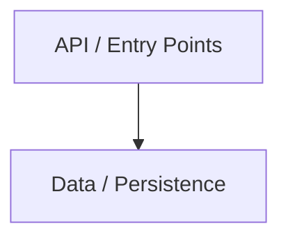
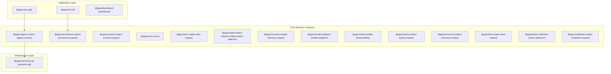
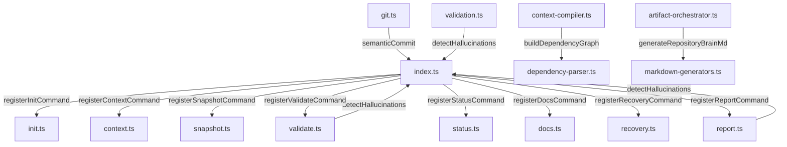
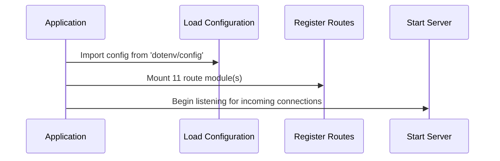
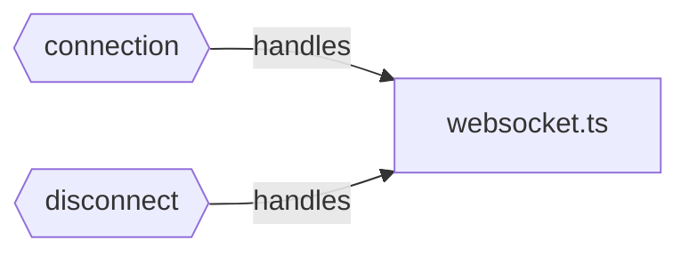
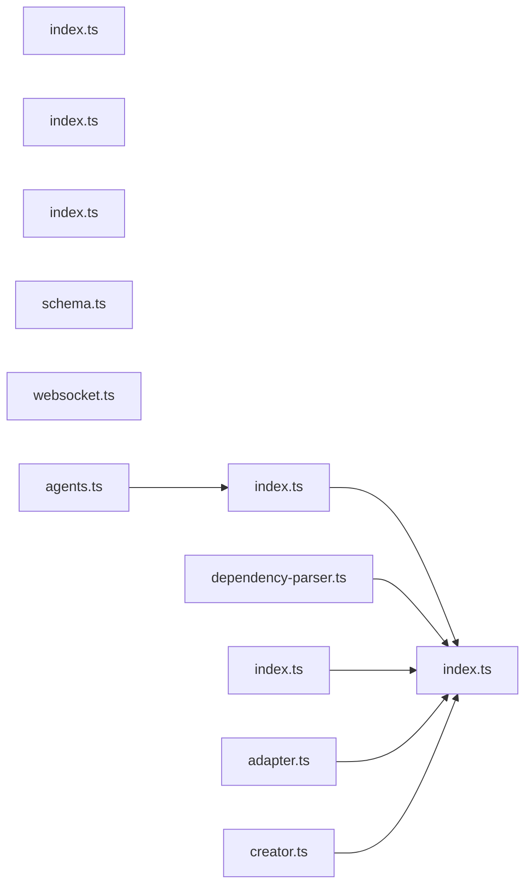

# AI REPOSITORY BRAIN — app

> **FOR AI AGENTS**: Brain can be primary context source. Verify edge cases in source.
> **Confidence**: 90% | **Generated**: 2026-05-30T12:29:48.192Z | **Engine**: PGOS AIRB v4.0.0
> **Files Analyzed**: 123 | **LOC**: 18,427 | **Duration**: 825ms
> **README**: > AI-native project runtime, validation, portability, recovery, context, and quality operating system for AI-assisted software development.

---

## TABLE OF CONTENTS

| § | Section | Key Intelligence |
|---|---------|-----------------|
| 1 | Project Identity | Name, stack, domain, maturity, goals |
| 2 | Domain Intelligence | Entities, capabilities, glossary |
| 3 | Architecture | Pattern, layers, boundaries, diagram |
| 4 | Knowledge Graph | Semantic relationship map |
| 5 | Feature Intelligence | Real features, business value |
| 6 | Function Intelligence | Per-function purpose, calls, side effects |
| 7 | Execution Intelligence | Startup, request traces, shutdown |
| 8 | State Intelligence | State owners, mutators, readers |
| 9 | Event Intelligence | Publishers, subscribers, dead events |
| 10 | Dependency Intelligence | Import graph, circulars, SPOFs |
| 11 | API & Contracts | Routes, auth, trust boundaries |
| 12 | Data Intelligence | Models, migrations, data flows |
| 13 | Configuration | Env vars, secrets, unsafe defaults |
| 14 | Test Intelligence | Coverage map, risk-based matrix |
| 15 | Change Impact Engine | Blast radius, affected features |
| 16 | Risk Intelligence | Risk scores, SPOFs, critical paths |
| 17 | Performance | Hot paths, bottlenecks, async coverage |
| 18 | Observability | Logging, metrics, blind spots |
| 19 | Security | Auth, secrets, trust boundaries |
| 20 | Technical Debt | TODOs, dead code, effort estimate |
| 21 | Project Memory | Decisions, evolution, active work |
| 22 | AI Operating System | ALWAYS / NEVER / BEFORE / AFTER |
| 23 | AI Navigation Engine | Task-based section routing |
| 24 | Token Compression | L0-L6 semantic compression |
| 25 | False Generation Prevention | Stub & drift detection |
| 26 | Validation Engine | Confidence, staleness, checks |
| 27 | Visualization Engine | Mermaid diagram index |
| 28 | Adoption & Usability | Onboarding, CI/CD, usage guide |
| 29 | Production Readiness | Readiness score, diagnostic scorecard |
| 30 | Autonomous Engineering | Dynamic workflows, safety checklist |
| 31 | Decision Memory (ADR) | Historical context, architectural decisions |
| 32 | Code Ownership Map | Subsystems, directories, team ownership |
| 33 | Runtime Dependency Graph | Transaction flow paths, traces |
| 34 | Repository Health | Build, coverage, dead code cockpit |
| 35 | AI Validation Pipeline | Defect, stub, test illusion detection |
| 36 | Feature Lifecycle | Feature maturity stages, risk tracking |
| 37 | Deployment Intelligence | CI/CD integrations, targets, environments |
| 38 | Disaster Recovery | Recovery procedures, snapshot maps |
| 39 | Knowledge Retention | Cognitive blindspots, documentation coverage |
| 40 | Continuous Learning | session feedback loops, learning rules |

---

## §1 — PROJECT IDENTITY

| Attribute | Value |
|-----------|-------|
| **Name** | app |
| **Type** | Monorepo |
| **Domain** | Analytics |
| **Primary Language** | TypeScript |
| **Framework** | React |
| **Architecture** | Monorepo |
| **Maturity** | Growth |
| **Scale** | 123 files · 18,427 LOC |
| **Languages** | TypeScript (15906), JavaScript (2521) |
| **Classes** | 61 |
| **Functions** | 372 |
| **API Endpoints** | 44 |
| **Risk Score** | 65/100 |
| **Confidence** | 90% |

### Executive Summary
app is a growth-grade TypeScript React application using Monorepo architecture. It contains 372 functions across 123 files with 44 API endpoints. The system implements 18 business feature(s) in the Analytics domain. Risk: 65/100. Confidence: 90%.

### Business Purpose
> AI-native project runtime, validation, portability, recovery, context, and quality operating system for AI-assisted software development.

---

## §2 — DOMAIN INTELLIGENCE

### Domain Entities (165)
| Entity | Type | File |
|--------|------|------|
| **Agent** | Interface | `packages/core/src/types/agent.ts` |
| **AgentConfig** | Interface | `packages/core/src/types/agent.ts` |
| **AgentTask** | Interface | `packages/core/src/types/agent.ts` |
| **AgentTaskInput** | Interface | `packages/core/src/types/agent.ts` |
| **AgentTaskOutput** | Interface | `packages/core/src/types/agent.ts` |
| **AgentFileChange** | Interface | `packages/core/src/types/agent.ts` |
| **AgentPipeline** | Interface | `packages/core/src/types/agent.ts` |
| **AgentStage** | Interface | `packages/core/src/types/agent.ts` |
| **AgentMemory** | Interface | `packages/core/src/types/agent.ts` |
| **ProjectIdentity** | Interface | `packages/core/src/types/ai-pos-types.ts` |
| **DomainModel** | Interface | `packages/core/src/types/ai-pos-types.ts` |
| **DomainEntity** | Interface | `packages/core/src/types/ai-pos-types.ts` |
| **DomainRelation** | Interface | `packages/core/src/types/ai-pos-types.ts` |
| **DomainLifecycle** | Interface | `packages/core/src/types/ai-pos-types.ts` |
| **GlossaryEntry** | Interface | `packages/core/src/types/ai-pos-types.ts` |
| **ArchitectureIntelligence** | Interface | `packages/core/src/types/ai-pos-types.ts` |
| **ArchitectureLayerDetail** | Interface | `packages/core/src/types/ai-pos-types.ts` |
| **CommunicationPattern** | Interface | `packages/core/src/types/ai-pos-types.ts` |
| **BoundaryDefinition** | Interface | `packages/core/src/types/ai-pos-types.ts` |
| **ExecutionFlows** | Interface | `packages/core/src/types/ai-pos-types.ts` |

### Domain Glossary
- **ScoreLabel**: Business entity inferred from getScoreLabel
- **Trace**: Business entity inferred from getTrace
- **AgentIds**: Business entity inferred from getAgentIds
- **Codebase**: Business entity inferred from validateCodebase
- **Agent**: Contract/interface: Agent
- **AgentConfig**: Contract/interface: AgentConfig
- **AgentTask**: Contract/interface: AgentTask
- **AgentTaskInput**: Contract/interface: AgentTaskInput
- **AgentTaskOutput**: Contract/interface: AgentTaskOutput
- **AgentFileChange**: Contract/interface: AgentFileChange
- **AgentPipeline**: Contract/interface: AgentPipeline
- **AgentStage**: Contract/interface: AgentStage
- **AgentMemory**: Contract/interface: AgentMemory
- **ProjectIdentity**: Contract/interface: ProjectIdentity
- **DomainModel**: Contract/interface: DomainModel
- **DomainEntity**: Contract/interface: DomainEntity
- **DomainRelation**: Contract/interface: DomainRelation
- **DomainLifecycle**: Contract/interface: DomainLifecycle
- **GlossaryEntry**: Contract/interface: GlossaryEntry
- **ArchitectureIntelligence**: Contract/interface: ArchitectureIntelligence

### Business Capabilities
- **Path**: 6 endpoint(s) [GET, POST, /PATH]
- **Agents**: 4 endpoint(s) [POST, GET]
- **Context**: 6 endpoint(s) [GET, POST]
- **Docs**: 4 endpoint(s) [POST, GET]
- **Git**: 6 endpoint(s) [POST, GET]
- **Memory**: 4 endpoint(s) [POST, GET]
- **Root**: 4 endpoint(s) [GET, POST]
- **:id**: 10 endpoint(s) [GET, PUT, DELETE]
- **Ingest**: 2 endpoint(s) [POST]
- **Health**: 6 endpoint(s) [GET]
- **Recovery**: 4 endpoint(s) [POST, GET]
- **Sessions**: 4 endpoint(s) [POST]
- **Snapshots**: 6 endpoint(s) [POST, GET]
- **Metrics**: 2 endpoint(s) [GET]
- **Info**: 2 endpoint(s) [GET]
- **Validate**: 8 endpoint(s) [POST]
- **L0**: 4 endpoint(s) [GET]
- **Users**: 6 endpoint(s) [GET, POST]
- **Auth**: 4 endpoint(s) [POST]
- **KEY**: 1 endpoint(s) [GET]

### Business Processes
- `getScoreLabel()` in `apps/cli/src/commands/validate.ts`
- `getTrace()` in `packages/agent-runtime/src/index.ts`
- `getAgentIds()` in `packages/agent-runtime/src/index.ts`
- `validateCodebase()` in `packages/context-engine/src/validators/continuous-validator.ts`
- `getLanguageFromExtension()` in `packages/core/src/utils/fs.ts`
- `getBaseName()` in `packages/core/src/utils/fs.ts`
- `getCurrentBranch()` in `packages/core/src/utils/git.ts`
- `getCurrentSha()` in `packages/core/src/utils/git.ts`
- `getShortSha()` in `packages/core/src/utils/git.ts`
- `getLog()` in `packages/core/src/utils/git.ts`
- `getChangedFiles()` in `packages/core/src/utils/git.ts`
- `getUntrackedFiles()` in `packages/core/src/utils/git.ts`
- `getStagedFiles()` in `packages/core/src/utils/git.ts`
- `createCommit()` in `packages/core/src/utils/git.ts`
- `getRemoteUrl()` in `packages/core/src/utils/git.ts`

### Entity Relationships
- AnthropicAdapter —[extends]→ BaseAdapter
- AnthropicAdapter —[depends-on]→ BaseAdapter
- AnthropicResponse —[depends-on]→ BaseAdapter
- BaseAdapter —[implements]→ ModelAdapter
- OllamaAdapter —[extends]→ BaseAdapter
- OllamaAdapter —[depends-on]→ BaseAdapter
- OllamaChatResponse —[depends-on]→ BaseAdapter
- OpenAIAdapter —[extends]→ BaseAdapter
- OpenAIAdapter —[depends-on]→ BaseAdapter
- OpenAIChatResponse —[depends-on]→ BaseAdapter

---

## §3 — ARCHITECTURE INTELLIGENCE

**Detected Pattern**: `Monorepo` (98% confidence)

### Architecture Confidence Matrix
| Pattern | Confidence |
|---------|-----------|
| Monorepo | 98% |
| Plugin | 35% |
| component-driven | 20% |


### Architecture Narrative
This system uses Monorepo architecture built on React. It is organized into 2 distinct layers.

### Evidence
- pnpm-workspace.yaml found — PNPM workspace
- turbo.json found — Turborepo build orchestration
- 15 packages: agent-runtime, architecture-guard, context-engine, core, doc-engine...
- 3 apps: api, cli, dashboard
- 60 cross-package imports
- Plugin/extension architecture
- React framework detected

### Layer Map
| Layer | Purpose | Directories |
|-------|---------|-------------|
| **API / Entry Points** | HTTP request handling and routing | `apps/api, apps/api/src/routes` |
| **Data / Persistence** | Data access and storage operations | `apps/api/src/db` |

### Architecture Diagram


### System Context Diagram (Three-Tier RIOS)


---

## §4 — REPOSITORY KNOWLEDGE GRAPH

| Metric | Count |
|--------|-------|
| Modules | 56 |
| Features | 18 |
| Entities | 26 |
| API Nodes | 0 |
| Relationships | 72 |

### Knowledge Graph Diagram


---

## §5 — FEATURE INTELLIGENCE

| Feature | Status | Business Value | Files | Tests | Coverage | Risk |
|---------|--------|----------------|-------|-------|----------|------|
| **Dashboard** | implemented | high | 7 | 1 | 14% | high |
| **Cli** | partial | medium | 9 | 0 | 0% | high |
| **Api** | implemented | high | 15 | 0 | 0% | high |
| **Context Engine** | implemented | high | 20 | 17 | 85% | high |
| **Core** | partial | high | 20 | 1 | 5% | high |
| **Model Adapters** | implemented | high | 5 | 1 | 20% | low |
| **Agent Runtime** | implemented | high | 1 | 1 | 100% | low |
| **Token Optimizer** | implemented | medium | 1 | 0 | 0% | high |
| **Observability** | implemented | medium | 1 | 0 | 0% | low |
| **Recovery Engine** | implemented | medium | 3 | 1 | 33% | low |
| **Memory Engine** | implemented | medium | 1 | 0 | 0% | low |
| **Semantic Git** | implemented | medium | 1 | 0 | 0% | low |
| **Hallucination Detector** | implemented | medium | 1 | 1 | 100% | low |
| **Doc Engine** | implemented | medium | 2 | 2 | 100% | low |
| **Policy Engine** | implemented | medium | 1 | 1 | 100% | low |
| **Architecture Guard** | implemented | medium | 0 | 1 | 100% | low |
| **Test Engine** | implemented | medium | 0 | 2 | 100% | low |
| **Validation Engine** | implemented | medium | 1 | 2 | 100% | low |

### Dashboard
- **Purpose**: Application: Dashboard. 13 function(s). 1 test file(s). exports: ArchitecturePage, DocsPage, RootLayout, MemoryBrowserPage, DashboardPage
- **Entrypoints**: `ArchitecturePage()`, `DocsPage()`, `RootLayout()`
- **Status**: implemented | **Coverage**: 14%

### Cli
- **Purpose**: Application: Cli. 1 API endpoint(s). 10 function(s)
- **Entrypoints**: `GET L0`
- **Status**: partial | **Coverage**: 0%

### Api
- **Purpose**: Application: Api. 33 API endpoint(s). 3 function(s)
- **Entrypoints**: `POST /:id/agents/run`, `GET /:id/agents/tasks`, `GET /:id/context`, `POST /:id/context/compile`, `POST /:id/context/export`
- **Status**: implemented | **Coverage**: 0%

### Context Engine
- **Purpose**: Package: Context Engine. 42 function(s). 17 test file(s)
- **Entrypoints**: `extractAPIIntelligence()`, `extractConfigIntelligence()`, `extractEventIntelligence()`
- **Status**: implemented | **Coverage**: 85%

### Core
- **Purpose**: Package: Core. 41 function(s). 1 test file(s)
- **Entrypoints**: `listFilesRecursive(), shouldIgnore(), fileExists(), safeStats(), safeReadFile(), safeWriteFile(), ensureDir(), safeRemove(), getLanguageFromExtension(), isBinaryFile(), getBaseName()`, `gitCommand(), isGitRepo(), getCurrentBranch(), getCurrentSha(), getShortSha(), getLog(), getChangedFiles(), getUntrackedFiles(), getStagedFiles(), createCommit(), getRemoteUrl(), stash(), stashPop()`, `sha256(), shortHash(), generateId(), slugify(), fingerprint()`
- **Status**: partial | **Coverage**: 5%

### Model Adapters
- **Purpose**: Package: Model Adapters. 21 function(s). 1 test file(s). exports: createAdapter, getSupportedProviders, validateConfig
- **Entrypoints**: `createAdapter(), getSupportedProviders(), validateConfig()`
- **Status**: implemented | **Coverage**: 20%

### Agent Runtime
- **Purpose**: Package: Agent Runtime. 15 function(s). 1 test file(s)
- **Status**: implemented | **Coverage**: 100%

### Token Optimizer
- **Purpose**: Package: Token Optimizer. 10 function(s)
- **Entrypoints**: `analyzeTokenUsage(), compressContext(), createBudget(), checkBudget(), generateMultiLevelSummary(), generateNavigationMap()`
- **Status**: implemented | **Coverage**: 0%

### Observability
- **Purpose**: Package: Observability. 9 function(s)
- **Status**: implemented | **Coverage**: 0%

### Recovery Engine
- **Purpose**: Package: Recovery Engine. 9 function(s). 1 test file(s). exports: restoreFromSnapshot, getRecoveryOptions, createSnapshot, listSnapshots, getSnapshot
- **Entrypoints**: `restoreFromSnapshot(), getRecoveryOptions()`, `createSnapshot(), listSnapshots(), getSnapshot()`
- **Status**: implemented | **Coverage**: 33%


---

## §6 — FUNCTION INTELLIGENCE

> Top 50 functions ranked by importance (cross-module calls, exports, handler status)

### `detectHallucinations()` — pure
- **Purpose**: detect hallucinations
- **File**: `packages/hallucination-detector/src/index.ts` L23
- **Params**: rootPath
- **Called By**: validation.ts, report.ts, validate.ts
- **Async**: Yes | **Exported**: Yes

### `semanticCommit()` — pure
- **Purpose**: semantic commit
- **File**: `packages/semantic-git/src/index.ts` L29
- **Params**: rootPath, message, options
- **Called By**: git.ts
- **Async**: Yes | **Exported**: Yes

### `semanticDiff()` — pure
- **Purpose**: semantic diff
- **File**: `packages/semantic-git/src/index.ts` L78
- **Params**: rootPath, fromCommit?, toCommit?
- **Called By**: git.ts
- **Async**: Yes | **Exported**: Yes

### `registerContextCommand()` — utility
- **Purpose**: Creates context command
- **File**: `apps/cli/src/commands/context.ts` L14
- **Params**: program
- **Called By**: index.ts
- **Side Effects**: HTTP calls
- **Async**: No | **Exported**: Yes

### `registerDocsCommand()` — pure
- **Purpose**: Creates docs command
- **File**: `apps/cli/src/commands/docs.ts` L6
- **Params**: program
- **Called By**: index.ts
- **Async**: No | **Exported**: Yes

### `registerInitCommand()` — pure
- **Purpose**: Creates init command
- **File**: `apps/cli/src/commands/init.ts` L13
- **Params**: program
- **Called By**: index.ts
- **Async**: No | **Exported**: Yes

### `registerRecoveryCommand()` — pure
- **Purpose**: Creates recovery command
- **File**: `apps/cli/src/commands/recovery.ts` L6
- **Params**: program
- **Called By**: index.ts
- **Async**: No | **Exported**: Yes

### `registerReportCommand()` — pure
- **Purpose**: Creates report command
- **File**: `apps/cli/src/commands/report.ts` L16
- **Params**: program
- **Calls**: detectHallucinations() in index.ts
- **Called By**: index.ts
- **Async**: No | **Exported**: Yes

### `registerSnapshotCommand()` — pure
- **Purpose**: Creates snapshot command
- **File**: `apps/cli/src/commands/snapshot.ts` L12
- **Params**: program
- **Called By**: index.ts
- **Async**: No | **Exported**: Yes

### `registerStatusCommand()` — pure
- **Purpose**: Creates status command
- **File**: `apps/cli/src/commands/status.ts` L12
- **Params**: program
- **Called By**: index.ts
- **Async**: No | **Exported**: Yes

### `registerValidateCommand()` — pure
- **Purpose**: Creates validate command
- **File**: `apps/cli/src/commands/validate.ts` L16
- **Params**: program
- **Calls**: detectHallucinations() in index.ts
- **Called By**: index.ts
- **Async**: No | **Exported**: Yes

### `generateRuntimeGraph()` — pure
- **Purpose**: generate runtime graph
- **File**: `packages/context-engine/src/generators/graph-generators.ts` L38
- **Params**: intel
- **Called By**: artifact-orchestrator.ts
- **Async**: No | **Exported**: Yes

### `generateRuntimeMd()` — pure
- **Purpose**: generate runtime md
- **File**: `packages/context-engine/src/generators/markdown-generators.ts` L150
- **Params**: intel
- **Called By**: artifact-orchestrator.ts
- **Async**: No | **Exported**: Yes

### `buildDependencyGraph()` — pure
- **Purpose**: build dependency graph
- **File**: `packages/context-engine/src/parser/dependency-parser.ts` L24
- **Params**: rootPath
- **Called By**: context-compiler.ts, continuous-validator.ts
- **Async**: Yes | **Exported**: Yes

### `ArchitecturePage()` — pure
- **Purpose**: architecture page
- **File**: `apps/dashboard/src/app/architecture/page.tsx` L10
- **Async**: No | **Exported**: Yes

### `DocsPage()` — pure
- **Purpose**: docs page
- **File**: `apps/dashboard/src/app/docs/page.tsx` L10
- **Async**: No | **Exported**: Yes

### `RootLayout()` — pure
- **Purpose**: root layout
- **File**: `apps/dashboard/src/app/layout.tsx` L10
- **Params**: {, }
- **Async**: No | **Exported**: Yes

### `MemoryBrowserPage()` — pure
- **Purpose**: memory browser page
- **File**: `apps/dashboard/src/app/memory/page.tsx` L10
- **Async**: No | **Exported**: Yes

### `DashboardPage()` — pure
- **Purpose**: dashboard page
- **File**: `apps/dashboard/src/app/page.tsx` L5
- **Async**: No | **Exported**: Yes

### `resolveImportPath()` — pure
- **Purpose**: resolve import path
- **File**: `packages/context-engine/src/parser/dependency-parser.ts` L133
- **Params**: currentFile, importSource, allFiles
- **Called By**: context-compiler.ts, continuous-validator.ts
- **Async**: No | **Exported**: Yes

### `createAdapter()` — pure
- **Purpose**: Creates adapter
- **File**: `packages/model-adapters/src/index.ts` L16
- **Params**: config
- **Async**: No | **Exported**: Yes

### `getSupportedProviders()` — pure
- **Purpose**: Retrieves supported providers
- **File**: `packages/model-adapters/src/index.ts` L63
- **Async**: No | **Exported**: Yes

### `validateConfig()` — pure
- **Purpose**: Validates config
- **File**: `packages/model-adapters/src/index.ts` L78
- **Params**: config
- **Async**: No | **Exported**: Yes

### `analyzeTokenUsage()` — pure
- **Purpose**: analyze token usage
- **File**: `packages/token-optimizer/src/index.ts` L30
- **Params**: contents, string>
- **Async**: No | **Exported**: Yes

### `compressContext()` — pure
- **Purpose**: compress context
- **File**: `packages/token-optimizer/src/index.ts` L51
- **Params**: content, maxTokens, strategy
- **Async**: No | **Exported**: Yes

### `createBudget()` — pure
- **Purpose**: Creates budget
- **File**: `packages/token-optimizer/src/index.ts` L105
- **Params**: totalTokens, allocations, number>
- **Async**: No | **Exported**: Yes

### `checkBudget()` — pure
- **Purpose**: Validates budget
- **File**: `packages/token-optimizer/src/index.ts` L126
- **Params**: budget, section, content
- **Async**: No | **Exported**: Yes

### `generateMultiLevelSummary()` — pure
- **Purpose**: generate multi level summary
- **File**: `packages/token-optimizer/src/index.ts` L143
- **Params**: intel, level
- **Async**: No | **Exported**: Yes

### `generateNavigationMap()` — pure
- **Purpose**: generate navigation map
- **File**: `packages/token-optimizer/src/index.ts` L208
- **Params**: intel
- **Async**: No | **Exported**: Yes

### `analyzeRuntime()` — pure
- **Purpose**: analyze runtime
- **File**: `packages/context-engine/src/analyzers/runtime-analyzer.ts` L9
- **Params**: mockRoot, files
- **Async**: No | **Exported**: Yes

### Function Call Graph


---

## §7 — EXECUTION INTELLIGENCE

### Startup Flow
1. **Load Configuration** — Import config from 'dotenv/config'; (`apps/api/src/server.ts`)
2. **Register Routes** — Mount 11 route module(s) (`apps/api/src/server.ts`)
3. **Start Server** — Begin listening for incoming connections (`apps/api/src/server.ts`)

### Request Processing Flow
1. **Run Middleware Chain** — Execute 1 middleware(s): index.ts
2. **Authenticate & Authorize** — Validate credentials and permissions
3. **Validate Input** — Schema validation and sanitization
4. **Execute Business Logic** — Route to appropriate service handler
5. **Persist / Fetch Data** — Database read/write operations
6. **Send Response** — Serialize and return response to client

### Per-Endpoint Execution Traces
**`POST /:id/validate`**:
Middleware(`index.ts`) → Route(`validation.ts`)

**`POST /:id/validate/completion`**:
Middleware(`index.ts`) → Route(`validation.ts`)

**`POST /:id/validate/hallucination`**:
Middleware(`index.ts`) → Route(`validation.ts`)

**`POST /:id/validate/architecture`**:
Middleware(`index.ts`) → Route(`validation.ts`)

**`POST /:id/validate`**:
Middleware(`index.ts`) → Route(`validation.ts`)

**`POST /:id/validate/completion`**:
Middleware(`index.ts`) → Route(`validation.ts`)

**`POST /:id/validate/hallucination`**:
Middleware(`index.ts`) → Route(`validation.ts`)

**`POST /:id/validate/architecture`**:
Middleware(`index.ts`) → Route(`validation.ts`)


### Shutdown Flow
- **Graceful Shutdown** — Handle SIGTERM/SIGINT, close connections, drain queues

### Startup Sequence Diagram


---

## §8 — STATE INTELLIGENCE

### State Mutators (10 files)
- `ai-pos-dropin.js` — Modifies application state
- `packages/agent-runtime/src/index.ts` — Modifies application state
- `packages/context-engine/src/__tests__/analyzers.test.ts` — Modifies application state
- `packages/context-engine/src/parser/ast-parser.ts` — Modifies application state
- `packages/core/src/errors/index.ts` — Modifies application state
- `packages/model-adapters/src/anthropic/adapter.ts` — Modifies application state
- `packages/model-adapters/src/base/adapter.ts` — Modifies application state
- `packages/model-adapters/src/ollama/adapter.ts` — Modifies application state
- `packages/model-adapters/src/openai/adapter.ts` — Modifies application state
- `packages/observability/src/index.ts` — Modifies application state

### State Readers (17 files)
- `ai-pos-dropin.js` — Reads application state
- `packages/agent-runtime/src/index.ts` — Reads application state
- `packages/context-engine/src/__tests__/analyzers.test.ts` — Reads application state
- `packages/context-engine/src/__tests__/validator.test.ts` — Reads application state
- `packages/context-engine/src/parser/ast-parser.ts` — Reads application state
- `packages/core/src/errors/index.ts` — Reads application state
- `packages/doc-engine/src/index.ts` — Reads application state
- `packages/doc-engine/src/reports/report-generator.ts` — Reads application state
- `packages/doc-engine/src/reports/savings-calculator.ts` — Reads application state
- `packages/memory-engine/src/index.ts` — Reads application state

---

## §9 — EVENT INTELLIGENCE

### Publishers (0)
- No event emissions detected

### Subscribers (2)
- `connection` handled in `apps/api/src/plugins/websocket.ts`
- `disconnect` handled in `apps/api/src/plugins/websocket.ts`

### Unhandled Events (listened but never emitted)
- `connection`
- `disconnect`

### Event Flow Diagram


---

## §10 — DEPENDENCY INTELLIGENCE

- **Modules**: 89 | **Edges**: 82 | **Circular**: 0

### Single Points of Failure
- `packages/core/src/index.ts` — 29 modules depend on this
- `packages/recovery-engine/src/index.ts` — 5 modules depend on this
- `packages/context-engine/src/index.ts` — 4 modules depend on this
- `packages/validation-engine/src/index.ts` — 3 modules depend on this
- `packages/hallucination-detector/src/index.ts` — 3 modules depend on this
- `packages/model-adapters/src/base/adapter.ts` — 3 modules depend on this

### External Dependencies (35)
- **path** — 46 file(s)
- **fs** — 36 file(s)
- **vitest** — 18 file(s)
- **url** — 12 file(s)
- **chalk** — 9 file(s)
- **ora** — 4 file(s)
- **commander** — 4 file(s)
- **drizzle-orm** — 3 file(s)
- **postgres** — 3 file(s)
- **pino** — 3 file(s)
- **child_process** — 3 file(s)
- **express** — 3 file(s)
- **fastify** — 2 file(s)
- **fastify-plugin** — 1 file(s)
- **socket.io** — 1 file(s)

### Dependency Graph


---

## §11 — API & CONTRACT INTELLIGENCE

### Endpoints (44)
| Method | Path | File | Line |
|--------|------|------|------|
| `GET` | `/path` | `ai-pos-dropin.js` | 270 |
| `POST` | `/path` | `ai-pos-dropin.js` | 272 |
| `/PATH` | `/path` | `ai-pos-dropin.js` | 274 |
| `POST` | `/:id/agents/run` | `apps/api/src/routes/agents.ts` | 12 |
| `GET` | `/:id/agents/tasks` | `apps/api/src/routes/agents.ts` | 47 |
| `GET` | `/:id/context` | `apps/api/src/routes/context.ts` | 10 |
| `POST` | `/:id/context/compile` | `apps/api/src/routes/context.ts` | 25 |
| `POST` | `/:id/context/export` | `apps/api/src/routes/context.ts` | 67 |
| `POST` | `/:id/docs/compile` | `apps/api/src/routes/docs.ts` | 10 |
| `GET` | `/:id/docs/coverage` | `apps/api/src/routes/docs.ts` | 44 |
| `POST` | `/:id/git/commit` | `apps/api/src/routes/git.ts` | 10 |
| `GET` | `/:id/git/diff` | `apps/api/src/routes/git.ts` | 36 |
| `GET` | `/:id/git/history` | `apps/api/src/routes/git.ts` | 54 |
| `POST` | `/:id/memory` | `apps/api/src/routes/memory.ts` | 11 |
| `GET` | `/:id/memory` | `apps/api/src/routes/memory.ts` | 29 |
| `GET` | `/` | `apps/api/src/routes/projects.ts` | 15 |
| `POST` | `/` | `apps/api/src/routes/projects.ts` | 24 |
| `GET` | `/:id` | `apps/api/src/routes/projects.ts` | 51 |
| `PUT` | `/:id` | `apps/api/src/routes/projects.ts` | 63 |
| `DELETE` | `/:id` | `apps/api/src/routes/projects.ts` | 79 |
| `POST` | `/:id/ingest` | `apps/api/src/routes/projects.ts` | 91 |
| `GET` | `/:id/health` | `apps/api/src/routes/projects.ts` | 126 |
| `POST` | `/:id/recovery/rollback` | `apps/api/src/routes/recovery.ts` | 10 |
| `GET` | `/:id/recovery/options` | `apps/api/src/routes/recovery.ts` | 40 |
| `POST` | `/:id/sessions` | `apps/api/src/routes/sessions.ts` | 10 |
| `POST` | `/:id/sessions/:sid/switch` | `apps/api/src/routes/sessions.ts` | 32 |
| `POST` | `/:id/snapshots` | `apps/api/src/routes/snapshots.ts` | 10 |
| `GET` | `/:id/snapshots` | `apps/api/src/routes/snapshots.ts` | 35 |
| `GET` | `/:id/snapshots/:sid` | `apps/api/src/routes/snapshots.ts` | 48 |
| `GET` | `/health` | `apps/api/src/routes/system.ts` | 10 |

### Authentication: Custom Auth, JWT
### Trust Boundaries: `packages/architecture-guard/src/index.ts`

---

## §12 — DATA INTELLIGENCE

_No database models or repositories detected._

---

## §13 — CONFIGURATION INTELLIGENCE

### Environment Variables (14)
| Variable | Sensitive | Confidence | Used In |
|----------|-----------|------------|---------|
| `DATABASE_URL` | No | 100% | `packages/context-engine/src/__tests__/test-standalone.js` |
| `DASHBOARD_URL` | No | 100% | `apps/api/src/server.ts` |
| `API_LOG_LEVEL` | No | 100% | `packages/core/src/utils/logger.ts` |
| `NODE_ENV` | No | 100% | `packages/core/src/utils/logger.ts` |
| `RATE_LIMIT_MAX` | No | 85% | `apps/api/src/server.ts` |
| `RATE_LIMIT_WINDOW_MS` | No | 85% | `apps/api/src/server.ts` |
| `API_PORT` | No | 100% | `apps/api/src/server.ts` |
| `API_HOST` | No | 100% | `apps/api/src/server.ts` |
| `NEXT_PUBLIC_API_URL` | No | 100% | `apps/dashboard/next.config.mjs` |
| `JWT_SECRET` | **YES** | 100% | `packages/context-engine/src/__tests__/analyzers.test.ts` |
| `LOG_LEVEL` | No | 85% | `packages/context-engine/src/__tests__/analyzers.test.ts` |
| `VITEST` | No | 85% | `packages/core/src/utils/logger.ts` |
| `get` | No | 20% | `packages/hallucination-detector/src/index.ts` |
| `KEY` | **YES** | 100% | `packages/hallucination-detector/src/index.ts` |

---

## §14 — TEST INTELLIGENCE

| Metric | Value |
|--------|-------|
| **Test Files** | 34 |
| **Tested Modules** | 40 |
| **Untested Source Files** | 61 |
| **Test Ratio** | 28% |

### Critical Untested Paths
- `apps/api/src/db/connection.ts` — Critical file with no test coverage
- `apps/api/src/db/schema.ts` — Critical file with no test coverage
- `apps/api/src/plugins/websocket.ts` — Critical file with no test coverage
- `apps/api/src/routes/agents.ts` — Critical file with no test coverage
- `apps/api/src/routes/docs.ts` — Critical file with no test coverage
- `apps/api/src/routes/git.ts` — Critical file with no test coverage
- `apps/api/src/routes/memory.ts` — Critical file with no test coverage
- `apps/api/src/routes/projects.ts` — Critical file with no test coverage
- `apps/api/src/routes/sessions.ts` — Critical file with no test coverage
- `apps/api/src/routes/snapshots.ts` — Critical file with no test coverage

### Feature → Test Map
- **Dashboard**: `page.tsx`
- **Cli**: No tests
- **Api**: No tests
- **Context Engine**: `analyzers.test.ts`, `brain-generator.test.ts`, `context.test.ts`, `generators.test.ts`, `ai-pos-dropin.js`, `test-standalone.js`, `validator.test.ts`, `vnext.test.ts`, `architecture-detector.ts`, `data-intelligence.ts`, `domain-extractor.ts`, `feature-detector.ts`, `index.ts`, `readiness-engine.ts`, `test-intelligence.ts`, `task-planner.ts`, `ast-parser.ts`
- **Core**: `core.test.ts`
- **Model Adapters**: `adapters.test.ts`
- **Agent Runtime**: `agent.test.ts`
- **Token Optimizer**: No tests
- **Observability**: No tests
- **Recovery Engine**: `recovery.test.ts`
- **Memory Engine**: No tests
- **Semantic Git**: No tests
- **Hallucination Detector**: `hallucination.test.ts`
- **Doc Engine**: `doc.test.ts`, `index.ts`
- **Policy Engine**: `policy.test.ts`

---

## §15 — CHANGE IMPACT ENGINE (BLAST RADIUS)

| File | Dependents | Tests | Risk | Score |
|------|-----------|-------|------|-------|
| `packages/core/src/index.ts` | 29 | 8 | critical | 97/100 |
| `apps/api/src/server.ts` | 0 | 0 | critical | 30/100 |
| `apps/cli/src/index.ts` | 0 | 0 | critical | 30/100 |
| `packages/recovery-engine/src/index.ts` | 5 | 0 | critical | 30/100 |
| `packages/token-optimizer/src/index.ts` | 0 | 0 | critical | 30/100 |
| `packages/validation-engine/src/index.ts` | 3 | 0 | high | 24/100 |
| `apps/api/src/db/schema.ts` | 1 | 0 | high | 23/100 |
| `apps/api/src/plugins/websocket.ts` | 1 | 0 | high | 23/100 |
| `apps/api/src/routes/agents.ts` | 1 | 0 | high | 23/100 |
| `apps/api/src/routes/context.ts` | 1 | 0 | high | 23/100 |
| `apps/api/src/routes/docs.ts` | 1 | 0 | high | 23/100 |
| `apps/api/src/routes/git.ts` | 1 | 0 | high | 23/100 |
| `apps/api/src/routes/memory.ts` | 1 | 0 | high | 23/100 |
| `apps/api/src/routes/projects.ts` | 1 | 0 | high | 23/100 |
| `apps/api/src/routes/recovery.ts` | 1 | 0 | high | 23/100 |
| `apps/api/src/routes/sessions.ts` | 1 | 0 | high | 23/100 |
| `apps/api/src/routes/snapshots.ts` | 1 | 0 | high | 23/100 |
| `apps/api/src/routes/system.ts` | 1 | 0 | high | 23/100 |
| `apps/api/src/routes/validation.ts` | 1 | 0 | high | 23/100 |
| `apps/cli/src/commands/context.ts` | 1 | 0 | high | 23/100 |

### Highest Impact Files
- **`packages/core/src/index.ts`** — 29 dependent(s), 8 test(s)
  - Affects features: Core
- **`apps/api/src/server.ts`** — 0 dependent(s), 0 test(s)
  - Affects features: Api
- **`apps/cli/src/index.ts`** — 0 dependent(s), 0 test(s)
  - Affects features: Cli
- **`packages/recovery-engine/src/index.ts`** — 5 dependent(s), 0 test(s)
  - Affects features: Recovery Engine
- **`packages/token-optimizer/src/index.ts`** — 0 dependent(s), 0 test(s)
  - Affects features: Token Optimizer

---

## §16 — RISK INTELLIGENCE

**Overall Risk Score: 65/100** [HIGH]

### Risk Calculation
| Factor | Count | Penalty |
|--------|-------|---------|
| Untested Critical Paths | 24 | +25 |
| TODO/FIXME Count | 25 | +15 |
| High Coupling Files | 2 | +6 |
| Complex Files (>15 funcs) | 3 | +9 |
| Missing Observability | 35 | +10 |

| Risk Factor | Count |
|-------------|-------|
| Critical Files | 35 |
| Untested Critical Paths | 24 |
| Circular Dependencies | 0 |
| High Coupling Files | 2 |
| Complex Files (>15 funcs) | 3 |
| SPOFs | 6 |

---

## §17 — PERFORMANCE INTELLIGENCE

### Hot Paths
- `apps/api/src/db/connection.ts` — Database operations [high]
- `apps/api/src/db/schema.ts` — Database operations [high]
- `packages/context-engine/src/__tests__/analyzers.test.ts` — Database operations [high]
- `packages/context-engine/src/__tests__/brain-generator.test.ts` — Database operations [high]
- `packages/context-engine/src/__tests__/context.test.ts` — Database operations [high]
- `packages/context-engine/src/__tests__/test-standalone.js` — Database operations [high]

### Async Coverage: 20/123 files use async patterns

---

## §18 — OBSERVABILITY INTELLIGENCE

| Capability | Status | Files |
|------------|--------|-------|
| Logging | YES | 3 |
| Metrics | NO | 0 |
| Tracing | NO | 0 |
| Health Checks | YES | 2 |

### Blind Spots
- `apps/api/src/db/connection.ts` — Critical file with no logging instrumentation
- `apps/api/src/db/schema.ts` — Critical file with no logging instrumentation
- `apps/api/src/plugins/websocket.ts` — Critical file with no logging instrumentation
- `apps/api/src/routes/agents.ts` — Critical file with no logging instrumentation
- `apps/api/src/routes/context.ts` — Critical file with no logging instrumentation
- `apps/api/src/routes/docs.ts` — Critical file with no logging instrumentation
- `apps/api/src/routes/git.ts` — Critical file with no logging instrumentation
- `apps/api/src/routes/memory.ts` — Critical file with no logging instrumentation
- `apps/api/src/routes/projects.ts` — Critical file with no logging instrumentation
- `apps/api/src/routes/recovery.ts` — Critical file with no logging instrumentation

---

## §19 — SECURITY INTELLIGENCE

### Authentication: Custom Auth, JWT
### Secret Management: 2 sensitive variable(s)
### Trust Boundaries: 1 middleware/guard file(s)

### Sensitive Variables
- `JWT_SECRET` in `packages/context-engine/src/__tests__/analyzers.test.ts`
- `KEY` in `packages/hallucination-detector/src/index.ts`

---

## §20 — TECHNICAL DEBT INTELLIGENCE

**Total**: 92 | **Critical**: 31 | **Effort**: Weeks

- [medium] **todo** in `ai-pos-dropin.js:324` — / FIXME / HACK Detection ───────────────────────
- [medium] **todo** in `ai-pos-dropin.js:327` — |FIXME|HACK|DEPRECATED|XXX|BUG)\b[:\s]*(.*)/i);
- [medium] **todo** in `ai-pos-dropin.js:877` — ' || t.type === 'FIXME').length;
- [medium] **todo** in `ai-pos-dropin.js:1021` — /FIXME Count', count: files.filter(f => f.todos.length > 0).length, penalty: Math.round(Math.min(15, files.filter(f => f
- [medium] **todo** in `ai-pos-dropin.js:1142` — of f.todos) {
- [medium] **todo** in `ai-pos-dropin.js:1144` — .type.toLowerCase(),
- [medium] **todo** in `ai-pos-dropin.js:1146` — .line,
- [medium] **todo** in `ai-pos-dropin.js:1147` — .text,
- [medium] **todo** in `ai-pos-dropin.js:1148` — .type === 'FIXME' || todo.type === 'BUG' ? 'high' : todo.type === 'HACK' ? 'high' : 'medium',
- [medium] **todo** in `ai-pos-dropin.js:1456` — ' || t.type === 'FIXME'));
- [medium] **todo** in `ai-pos-dropin.js:1458` — /FIXME markers` });
- [medium] **todo** in `ai-pos-dropin.js:1459` — /FIXME` });
- [medium] **todo** in `ai-pos-dropin.js:2357` — placeholders, or incomplete implementations');
- [medium] **todo** in `ai-pos-dropin.js:2421` — ' || t.type === 'FIXME'));
- [medium] **todo** in `ai-pos-dropin.js:2776` — placeholders, or incomplete implementations
- [high] **hack** in `apps/api/src/db/connection.ts:16` — to parse safely
- [medium] **todo** in `apps/cli/src/commands/init.ts:70` — ', pattern: 'TODO', description: 'Disallow TODO comments in production code' },
- [high] **fixme** in `apps/cli/src/commands/init.ts:71` — ', pattern: 'FIXME', description: 'Disallow FIXME comments' },
- [high] **hack** in `apps/cli/src/commands/init.ts:72` — ', pattern: 'HACK', description: 'Disallow HACK markers' },
- [medium] **todo** in `apps/cli/src/commands/report.ts:69` — wire to real doc coverage when available

### Dead Exports
- `client` in `apps/api/src/db/connection.ts`
- `db` in `apps/api/src/db/connection.ts`
- `Database` in `apps/api/src/db/connection.ts`
- `Agent` in `packages/core/src/types/agent.ts`
- `AgentType` in `packages/core/src/types/agent.ts`
- `AgentConfig` in `packages/core/src/types/agent.ts`
- `AgentTask` in `packages/core/src/types/agent.ts`
- `AgentTaskStatus` in `packages/core/src/types/agent.ts`
- `AgentTaskInput` in `packages/core/src/types/agent.ts`
- `AgentTaskOutput` in `packages/core/src/types/agent.ts`

---

## §21 — PROJECT MEMORY

> This section supports multi-session AI development continuity. AI agents should append decisions here.

### Architecture Decisions
_No decisions logged yet. Append here after major changes._

### Evolution History
- **2026-05-30T12:29:48.192Z**: Brain generated. 123 files, 372 functions, 90% confidence.

---

## §22 — AI OPERATING SYSTEM

### ALWAYS
- Brain can be primary context source. Verify edge cases in source.
- Preserve all existing comments, docstrings, and documentation
- Match the existing code style (indentation, brackets, naming)
- Check blast radius (§15) before modifying any file
- Verify all imports resolve correctly

### NEVER
- Never delete test files without replacements
- Never hardcode credentials, API keys, or secrets
- Never leave empty stubs, TODO placeholders, or incomplete implementations
- Never modify Critical zone files without blast radius analysis
- Never break existing public interfaces or API contracts

### BEFORE EDITING
- Check file safety zone in §5 and §15
- Review blast radius for cascading impacts
- Review function intelligence in §6 for the target function
- Identify affected tests in §14

### AFTER EDITING
- Validate compilation with zero errors
- Run all affected test suites
- Regenerate this Brain file if public interfaces changed

### SAFE FILES (34)
- `ai-pos-dropin.js`
- `apps/dashboard/src/app/validation/page.tsx`
- `packages/agent-runtime/src/__tests__/agent.test.ts`
- `packages/architecture-guard/src/index.ts`
- `packages/context-engine/src/__tests__/analyzers.test.ts`

### CAUTION FILES (54)
- `packages/agent-runtime/src/index.ts`
- `packages/context-engine/src/analyzers/api-extractor.ts`
- `packages/context-engine/src/analyzers/event-intelligence.ts`
- `packages/context-engine/src/analyzers/observability-extractor.ts`
- `packages/context-engine/src/analyzers/risk-analyzer.ts`

### CRITICAL FILES (35) — DO NOT MODIFY without §15 analysis
- `apps/api/src/db/connection.ts` — Reads env: DATABASE_URL.
- `apps/api/src/db/schema.ts` — Domain model definition: schema.
- `apps/api/src/plugins/websocket.ts` — Listens for: connection, disconnect. Reads env: DASHBOARD_URL.
- `apps/api/src/routes/agents.ts` — Defines 4 HTTP endpoint(s) (POST/GET).
- `apps/api/src/routes/context.ts` — Defines 6 HTTP endpoint(s) (GET/POST).
- `apps/api/src/routes/docs.ts` — Defines 4 HTTP endpoint(s) (POST/GET).
- `apps/api/src/routes/git.ts` — Defines 6 HTTP endpoint(s) (POST/GET).
- `apps/api/src/routes/memory.ts` — Defines 4 HTTP endpoint(s) (POST/GET).
- `apps/api/src/routes/projects.ts` — Defines 14 HTTP endpoint(s) (GET/POST/PUT/DELETE).
- `apps/api/src/routes/recovery.ts` — Defines 4 HTTP endpoint(s) (POST/GET).

---

## §23 — AI NAVIGATION ENGINE

| Need | Go To |
|------|-------|
| Architecture understanding | §3 Architecture Intelligence |
| What business features exist | §5 Feature Intelligence |
| How a function works | §6 Function Intelligence |
| Request execution path | §7 Execution Intelligence |
| What database tables exist | §12 Data Intelligence |
| What tests cover a feature | §14 Test Intelligence |
| Impact of changing a file | §15 Change Impact Engine |
| Security & auth mechanism | §19 Security Intelligence |
| Technical debt priorities | §20 Technical Debt |
| Safe editing rules | §22 AI Operating System |

---

## §24 — TOKEN COMPRESSION ENGINE

**L0 — Repository Snapshot** (~50 tokens)
app: TypeScript React app, Monorepo, 123 files, 18,427 LOC, Analytics.

**L1 — Architecture Summary** (~150 tokens)
Monorepo with 2 layers. 44 endpoints, 61 classes, Custom Auth/JWT auth. Risk: 65/100.

**L2 — Runtime Summary** (~200 tokens)
Startup: Load Configuration → Register Routes → Start Server. Request: Run Middleware Chain → Authenticate & Authorize → Validate Input → Execute Business Logic → Persist / Fetch Data → Send Response.

**L3 — Feature Summary** (~300 tokens)
Dashboard [implemented/14%], Cli [partial/0%], Api [implemented/0%], Context Engine [implemented/85%], Core [partial/5%], Model Adapters [implemented/20%], Agent Runtime [implemented/100%], Token Optimizer [implemented/0%], Observability [implemented/0%], Recovery Engine [implemented/33%].

**L4 — Module Summary** (~500 tokens)
.: 3 files. apps/api/src/db: 2 files. apps/api/src/plugins: 1 files. apps/api/src/routes: 11 files. apps/api/src: 1 files. apps/cli/src/commands: 8 files. apps/cli/src: 1 files. apps/dashboard: 2 files. apps/dashboard/src/app/architecture: 1 files. apps/dashboard/src/app/docs: 1 files. apps/dashboard/src/app: 2 files. apps/dashboard/src/app/memory: 1 files. apps/dashboard/src/app/validation: 1 files. packages/agent-runtime/src/__tests__: 1 files. packages/agent-runtime/src: 1 files.

**L5 — File Intelligence**: See §5 (Features) and §15 (Blast Radius)
**L6 — Function Intelligence**: See §6 (top 50 functions with purpose, calls, side effects)

---

## §25 — FALSE GENERATION PREVENTION

| Check | Status |
|-------|--------|
| Real function bodies | YES (372) |
| Stub/placeholder files | WARNING (19) |
| Import resolution | WARNING |
| Test coverage exists | YES |
| Domain entities resolved | YES (165) |
| Function intelligence | YES (top 50) |

---

## §26 — VALIDATION ENGINE

**Confidence Score: 90%** [HIGH]

> Brain can be primary context source. Verify edge cases in source.

### Confidence Breakdown
| Check | Weight | Score | Detail |
|-------|--------|-------|--------|
| Import Resolution | 25 | 86% | 171/199 resolved |
| Dependency Graph | 20 | 100% | 82 edges across 89 modules |
| Feature Test Coverage | 15 | 67% | 12/18 features have tests |
| Architecture Intelligence | 10 | 100% | Cross-module dependencies mapped |
| No Circular Dependencies | 10 | 100% | 0 cycle(s) |
| Code Quality | 10 | 85% | 19 files with TODO/FIXME |
| Function Intelligence | 10 | 100% | 372 functions analyzed |

### Issues (30)
- [broken-import] Unresolved: ./globals.css
- [broken-import] Unresolved: ./app.js
- [broken-import] Unresolved: ./utils/logger.js
- [broken-import] Unresolved: ./middleware/auth.js
- [broken-import] Unresolved: ./routes/users.js
- [broken-import] Unresolved: ../services/user-service.js
- [broken-import] Unresolved: ../middleware/auth.js
- [broken-import] Unresolved: ../repositories/user-repository.js
- [broken-import] Unresolved: ../db/connection.js
- [broken-import] Unresolved: ../db/schema.js
- [broken-import] Unresolved: ../services/user-service.js
- [broken-import] Unresolved: ../services/user.service
- [broken-import] Unresolved: ../db/database
- [broken-import] Unresolved: ./cycleB
- [broken-import] Unresolved: ./cycleA

### Quality Manifest
| Check | Result |
|-------|--------|
| All 28 AIRB sections | YES |
| Semantic descriptions | YES |
| Domain intelligence | YES |
| Knowledge graph | YES (100 nodes) |
| Function intelligence | YES (50 functions) |
| Mermaid diagrams | YES |
| Blast radius | YES |
| Risk scoring | YES (65/100) |
| Token optimization (L0-L6) | YES |

---

## §27 — VISUALIZATION ENGINE

All Mermaid diagrams are embedded in their respective sections:
- Architecture diagram: §3
- Knowledge graph: §4
- Function call graph: §6
- Startup sequence: §7
- Event flow: §9
- Dependency graph: §10
- Data flow: §12

---

## §28 — ADOPTION & USABILITY

### For AI Agents
1. Read this Brain file FIRST before any source code
2. Use §23 Navigation Engine to find the right section
3. Use §24 Token Compression for context-limited prompts
4. Check §22 AI Operating System before making changes
5. Check §15 Change Impact before modifying critical files

### For Human Developers
1. Run `./ai-pos-dropin.ps1` (Windows) or `./ai-pos-dropin.sh` (Linux/Mac)
2. Commit `.guardian/ai-pos/AI_REPOSITORY_BRAIN.md` to your repository
3. AI assistants (Cursor, Copilot, Windsurf) will auto-read `.cursorrules`
4. Regenerate after major changes to keep intelligence current

### CI/CD Integration
```yaml
# GitHub Actions
- name: Generate AI Brain
  run: |
    docker run --rm -v "${{ github.workspace }}:/app" -w /app node:20-alpine \
      node ai-pos-dropin.js
```

---

## §29 — PRODUCTION READINESS ENGINE

**Overall Score: 65%** | **Status: NEEDS REFRACTORING**

### Diagnostic Scorecard
| Evaluation Area | Score | Details |
|-----------------|-------|---------|
| Build/Compile Configuration | 40% | No typescript build configuration seen |
| Test Suite Density | 57% | 34 tests for 89 production files |
| Security Architecture | 100% | No missing auth on sensitive routes detected |
| Observability & Logging | 30% | 35 critical files lack logger imports |
| Code Integrity (Zero Stubs) | 100% | Zero stubs/placeholders found |


---

## §30 — AUTONOMOUS ENGINEERING WORKFLOWS

> High-fidelity task execution plans and safety protocols for autonomous coding agents.

### Task: Add New REST API Endpoint
- **Confidence**: 95% | **Estimated Blast Radius**: Medium (3-5 files)
- **Action Steps**:
  1. Define routing interface under apps/api/src/routes/ or equivalent routes path
  2. Model payload validation schema matching the business entity (e.g. using Drizzle or Fastify schemas)
  3. Register route inside primary server instance
  4. Implement route controller and delegate core logic to Domain Services
  5. Create integration tests matching the endpoint under tests/ integration paths
  6. Run validation checks to ensure zero stub functions are introduced

### Task: Integrate New Core Engine Analyzer
- **Confidence**: 90% | **Estimated Blast Radius**: Low (2 files)
- **Action Steps**:
  1. Implement class structure extending a base adapter pattern
  2. Add static parsing functions within the new package
  3. Map new capabilities inside the Feature matrix
  4. Validate using standard workspace vitest suite

### Self-Correction & Safety Checklist
1. Verify target directory structures before executing file creation.
2. Perform dry-run dry-compilation using typescript type checks.
3. Execute vitest suite to ensure no regression failures were introduced.
4. Conduct a stub and placeholder check to catch un-implemented code blocks.


---

## §31 — ARCHITECTURAL DECISION RECORDS (ADR) MEMORY

> Historical architectural decision logs to prevent design debates across agent sessions.

### Architectural Decision: Monorepo Orchestration
- **File**: `Inferred ADR 1` | **Date**: 2026-05-30
- **Decision**: Use PNPM Workspaces combined with Turborepo for monorepo build coordination and caching.
- **Reasoning**: Saves build time in CI/CD pipeline and coordinates package dependency maps locally.
- **Alternatives Considered**: Nx, Lerna

### Architectural Decision: RIOS Execution
- **File**: `Inferred ADR 2` | **Date**: 2026-05-30
- **Decision**: Pure Node.js zero-dependency ESM pipeline for repository digital twin mapping.
- **Reasoning**: Enables rapid execution on host or isolated environments without dependency hell.
- **Alternatives Considered**: Python scanning script, Rust binary


---

## §32 — CODE OWNERSHIP & RESPONSIBILITY MAP

| System Area | Source Files | Responsibility Lead | Core Interface Files |
|-------------|--------------|---------------------|----------------------|
| Application Interfaces | 32 | API/Frontend Team | `connection.ts, schema.ts, websocket.ts` |
| Core Services & Engines | 57 | Systems Architect Team | `index.ts, config-extractor.ts, event-intelligence.ts` |
| Infrastructure Storage & Adapters | 0 | Platform Team | `` |


---

## §33 — RUNTIME DEPENDENCY GRAPH

> Visualizing transaction executions, logic traces, and service chains.

### Flow: RIOS Generation Execution Trace
**Dashboard/CLI** (`ai-pos-dropin.js`) ➔ **Scanner Engine** (`ai-pos-dropin.js`) ➔ **AST Analyzer** (`ai-pos-dropin.js`) ➔ **Cross-Intelligence Engine** (`ai-pos-dropin.js`) ➔ **Digital Twin Writer** (`AI_REPOSITORY_BRAIN.md`)

| Order | Step | File Path | Inferred Action |
|-------|------|-----------|-----------------|
| 1 | Dashboard/CLI | `ai-pos-dropin.js` | Process bootstrap and workspace discovery |
| 2 | Scanner Engine | `ai-pos-dropin.js` | Walks file tree filtering test/mock scopes |
| 3 | AST Analyzer | `ai-pos-dropin.js` | Regex analysis for functions, imports, stubs, and interfaces |
| 4 | Cross-Intelligence Engine | `ai-pos-dropin.js` | Constructs dependency call graphs and architecture matrix |
| 5 | Digital Twin Writer | `AI_REPOSITORY_BRAIN.md` | Publishes complete Repository twin containing 40 sections |

### Flow: Core Agent Execution Trace (Inferred)
**Interface** (`dashboard`) ➔ **Routing API** (`api`) ➔ **Context Engine** (`context-engine`) ➔ **LLM Adapter** (`model-adapters`)

| Order | Step | File Path | Inferred Action |
|-------|------|-----------|-----------------|
| 1 | Interface | `apps/dashboard` | Receives user natural language instructions |
| 2 | Routing API | `apps/api` | Dispatches request to Context Engine |
| 3 | Context Engine | `packages/context-engine` | Reads AI Repository Brain for codebase structures |
| 4 | LLM Adapter | `packages/model-adapters` | Fetches code changes from LLM with zero scans |


---

## §34 — REPOSITORY HEALTH DASHBOARD

### System Context Dashboard
| Metric | Status / Value | Indicator |
|--------|----------------|-----------|
| **Build Compile** | PASSING | OK |
| **Total Code Files** | 123 | 89 Prod / 34 Tests / 1 Mocks |
| **Test Coverage Density** | 38% | WARNING |
| **Dead Code Modules** | 0 file(s) | Heuristic potential dead exports |
| **Circular Dependencies** | 0 cycle(s) | CLEAN |
| **Placeholders & Stubs** | 0 stub(s) | Flagged un-implemented markers |
| **Deployment Readiness** | 65% | NEEDS REFRACTORING |


---

## §35 — AI VALIDATION PIPELINE

> Identifying stubs, unimplemented placeholder logic, and test illusions.

### Stubs & Placeholders (0 found)
- Zero unimplemented stub functions detected

### Fake Success Assertions (0 found)
- Zero fake success mock returns detected

### Test Illusions (3 found)
- Found literal static assertion (possible test illusion) in `apps/dashboard/src/app/validation/page.tsx`
- Found literal static assertion (possible test illusion) in `packages/context-engine/src/__tests__/analyzers.test.ts`
- Found literal static assertion (possible test illusion) in `packages/context-engine/src/__tests__/validator.test.ts`


---

## §36 — FEATURE LIFECYCLE INTELLIGENCE

| Mapped Feature | Maturity Stage | Test Coverage | Risk Level |
|----------------|----------------|---------------|------------|
| Dashboard | Prototype / Unstable | 14% | high |
| Cli | Prototype / Unstable | 0% | high |
| Api | Prototype / Unstable | 0% | high |
| Context Engine | Stable | 85% | high |
| Core | Prototype / Unstable | 5% | high |
| Model Adapters | Active Refactoring | 20% | low |
| Agent Runtime | Stable | 100% | low |
| Token Optimizer | Prototype / Unstable | 0% | high |
| Observability | Prototype / Unstable | 0% | low |
| Recovery Engine | Stable | 33% | low |
| Memory Engine | Prototype / Unstable | 0% | low |
| Semantic Git | Prototype / Unstable | 0% | low |
| Hallucination Detector | Stable | 100% | low |
| Doc Engine | Stable | 100% | low |
| Policy Engine | Stable | 100% | low |
| Architecture Guard | Stable | 100% | low |
| Test Engine | Stable | 100% | low |
| Validation Engine | Stable | 100% | low |


---

## §37 — DEPLOYMENT INTELLIGENCE

### Target Environments & Runtimes
- **Local Process Execution**: Configured in `package.json script runners`

### CI/CD Pipeline Configuration
- **No CI Workflow configuration found**: Loaded from ``


---

## §38 — DISASTER RECOVERY INTELLIGENCE

### Rollback Procedures
#### Action: Codebase State Snapshot rollback
- Leverage git tree snapshots or recovery package rollbacks to restore last stable commit.

#### Action: Automated Health Verification
- Verify system context by running full vitest workspace build: pnpm test.


---

## §39 — KNOWLEDGE RETENTION ENGINE

- **Semantic Documentation Coverage**: 6% of code files have meaningful description text.

### Cognitive Blindspots (No structural descriptions)
- `apps/api/src/db/connection.ts`
- `apps/api/src/db/schema.ts`
- `apps/api/src/routes/agents.ts`
- `apps/api/src/routes/context.ts`
- `apps/api/src/routes/docs.ts`
- `apps/api/src/routes/git.ts`
- `apps/api/src/routes/memory.ts`
- `apps/api/src/routes/projects.ts`
- `apps/api/src/routes/recovery.ts`
- `apps/api/src/routes/sessions.ts`


---

## §40 — CONTINUOUS LEARNING ENGINE

### AI Operating Rules & Feedback Loops
- Feedback loops should update .guardian/ai-pos/AI_REPOSITORY_BRAIN.md after major system updates
- AI sessions must trace and log successful modifications to the ADR Memory block §31
- Continuous learning metrics should track repeat code patterns and adjust blocklists dynamically


---

*Generated by PGOS RIOS v4.0.0 | 2026-05-30T12:29:48.192Z | DO NOT EDIT MANUALLY*
*Regenerate: ./ai-pos-dropin.ps1 (Windows) or ./ai-pos-dropin.sh (Linux/macOS)*