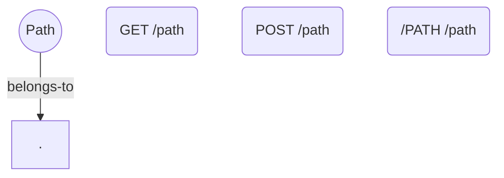
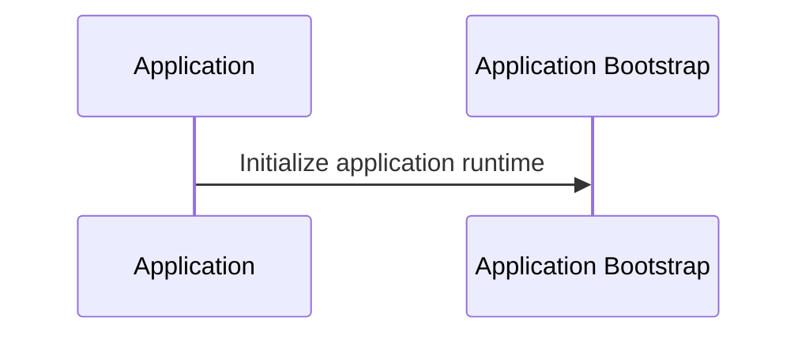
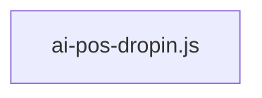

# AI REPOSITORY BRAIN — app

> **FOR AI AGENTS**: This is the SINGLE master intelligence file. Read this FIRST — it replaces 90-98% of full repository scanning.
> **Confidence**: 85% | **Generated**: 2026-05-30T04:25:20.717Z | **Engine**: PGOS AIRB v3.0.0
> **Files Analyzed**: 1 | **LOC**: 1,718 | **Duration**: 93ms

---

## TABLE OF CONTENTS

| § | Section | Key Intelligence |
|---|---------|-----------------|
| 1 | Project Identity | Name, stack, domain, maturity, goals |
| 2 | Domain Intelligence | Entities, capabilities, glossary |
| 3 | Architecture | Pattern, layers, boundaries, diagram |
| 4 | Knowledge Graph | Semantic relationship map |
| 5 | Feature Intelligence | Real features, business value |
| 6 | Function Intelligence | Per-function purpose, calls, side effects |
| 7 | Execution Intelligence | Startup, request traces, shutdown |
| 8 | State Intelligence | State owners, mutators, readers |
| 9 | Event Intelligence | Publishers, subscribers, dead events |
| 10 | Dependency Intelligence | Import graph, circulars, SPOFs |
| 11 | API & Contracts | Routes, auth, trust boundaries |
| 12 | Data Intelligence | Models, migrations, data flows |
| 13 | Configuration | Env vars, secrets, unsafe defaults |
| 14 | Test Intelligence | Coverage map, risk-based matrix |
| 15 | Change Impact Engine | Blast radius, affected features |
| 16 | Risk Intelligence | Risk scores, SPOFs, critical paths |
| 17 | Performance | Hot paths, bottlenecks, async coverage |
| 18 | Observability | Logging, metrics, blind spots |
| 19 | Security | Auth, secrets, trust boundaries |
| 20 | Technical Debt | TODOs, dead code, effort estimate |
| 21 | Project Memory | Decisions, evolution, active work |
| 22 | AI Operating System | ALWAYS / NEVER / BEFORE / AFTER |
| 23 | AI Navigation Engine | Task-based section routing |
| 24 | Token Compression | L0-L6 semantic compression |
| 25 | False Generation Prevention | Stub & drift detection |
| 26 | Validation Engine | Confidence, staleness, checks |
| 27 | Visualization Engine | Mermaid diagram index |
| 28 | Adoption & Usability | Onboarding, CI/CD, usage guide |

---

## §1 — PROJECT IDENTITY

| Attribute | Value |
|-----------|-------|
| **Name** | app |
| **Type** | Single Package |
| **Domain** | AI / Machine Learning |
| **Primary Language** | JavaScript |
| **Framework** | Plain Application |
| **Architecture** | Layered |
| **Maturity** | Prototype |
| **Scale** | 1 files · 1,718 LOC |
| **Languages** | JavaScript (1718) |
| **Classes** | 3 |
| **Functions** | 49 |
| **API Endpoints** | 6 |
| **Risk Score** | 3/100 |
| **Confidence** | 85% |

### Executive Summary
app is a prototype-grade JavaScript application using Layered architecture. It contains 49 functions across 1 files with 6 API endpoints. The system implements 1 business feature(s) in the AI / Machine Learning domain. Risk: 3/100. Confidence: 85%.

---

## §2 — DOMAIN INTELLIGENCE


### Domain Glossary
- **Dirs**: Business entity inferred from findDirs
- **Intelligence**: Business entity inferred from validateIntelligence

### Business Capabilities
- **Path**: 6 endpoint(s) [GET, POST, /PATH]

### Business Processes
- `findDirs()` in `ai-pos-dropin.js`
- `validateIntelligence()` in `ai-pos-dropin.js`
_No domain entities detected. Domain intelligence improves with model/entity class definitions._

---

## §3 — ARCHITECTURE INTELLIGENCE

**Detected Pattern**: `Layered` (30% confidence)

### Architecture Narrative
This system uses Layered architecture built on Plain Application. It is organized into 1 distinct layers.

### Evidence

### Layer Map
| Layer | Purpose | Directories |
|-------|---------|-------------|
| **Application** | Main application code | `src` |

### Architecture Diagram


---

## §4 — REPOSITORY KNOWLEDGE GRAPH

| Metric | Count |
|--------|-------|
| Modules | 1 |
| Features | 1 |
| Entities | 0 |
| API Nodes | 6 |
| Relationships | 1 |

### Knowledge Graph Diagram


---

## §5 — FEATURE INTELLIGENCE

| Feature | Status | Business Value | Files | Tests | Coverage | Risk |
|---------|--------|----------------|-------|-------|----------|------|
| **Path** | partial | high | 1 | 0 | 73% | medium |

### Path
- **Purpose**: Handles path operations via 6 endpoint(s)
- **Entrypoints**: `GET /path`, `GET /path`, `POST /path`, `/PATH /path`, `GET /path`
- **Status**: partial | **Coverage**: 73%


---

## §6 — FUNCTION INTELLIGENCE

> Top 49 functions ranked by importance (cross-module calls, exports, handler status)

### `scanDirectory()` — utility
- **Purpose**: scan directory
- **File**: `ai-pos-dropin.js` L69
- **Params**: dir, root, list
- **Side Effects**: writes state
- **Async**: Yes | **Exported**: No

### `scanAllFiles()` — utility
- **Purpose**: scan all files
- **File**: `ai-pos-dropin.js` L84
- **Params**: dir, root, list
- **Side Effects**: writes state
- **Async**: Yes | **Exported**: No

### `analyzeFile()` — utility
- **Purpose**: analyze file
- **File**: `ai-pos-dropin.js` L103
- **Params**: filePath, rootPath
- **Side Effects**: writes state
- **Async**: Yes | **Exported**: No

### `parseReadme()` — utility
- **Purpose**: parse readme
- **File**: `ai-pos-dropin.js` L1145
- **Params**: rootPath
- **Side Effects**: writes state
- **Async**: Yes | **Exported**: No

### `main()` — utility
- **Purpose**: main
- **File**: `ai-pos-dropin.js` L1984
- **Side Effects**: writes state
- **Async**: Yes | **Exported**: No

### `name()` — utility
- **Purpose**: name
- **File**: `ai-pos-dropin.js` L169
- **Side Effects**: writes state
- **Async**: No | **Exported**: No

### `generateSemanticDesc()` — utility
- **Purpose**: generate semantic desc
- **File**: `ai-pos-dropin.js` L286
- **Params**: f
- **Side Effects**: writes state
- **Async**: No | **Exported**: No

### `buildFunctionCallGraph()` — utility
- **Purpose**: build function call graph
- **File**: `ai-pos-dropin.js` L319
- **Params**: files
- **Side Effects**: writes state
- **Async**: No | **Exported**: No

### `resolveImportPath()` — utility
- **Purpose**: resolve import path
- **File**: `ai-pos-dropin.js` L385
- **Params**: currentFile, importSource, files
- **Side Effects**: writes state
- **Async**: No | **Exported**: No

### `buildCallChains()` — utility
- **Purpose**: build call chains
- **File**: `ai-pos-dropin.js` L397
- **Params**: files, edges
- **Side Effects**: writes state
- **Async**: No | **Exported**: No

### `traceChain()` — utility
- **Purpose**: trace chain
- **File**: `ai-pos-dropin.js` L408
- **Params**: file, edges, visited, depth
- **Side Effects**: writes state
- **Async**: No | **Exported**: No

### `buildDependencyGraph()` — utility
- **Purpose**: build dependency graph
- **File**: `ai-pos-dropin.js` L422
- **Params**: files
- **Side Effects**: writes state
- **Async**: No | **Exported**: No

### `dfs()` — utility
- **Purpose**: dfs
- **File**: `ai-pos-dropin.js` L454
- **Params**: u, path
- **Side Effects**: writes state
- **Async**: No | **Exported**: No

### `detectArchitecture()` — utility
- **Purpose**: detect architecture
- **File**: `ai-pos-dropin.js` L494
- **Params**: files, rootPath
- **Side Effects**: writes state
- **Async**: No | **Exported**: No

### `findDirs()` — utility
- **Purpose**: Retrieves dirs
- **File**: `ai-pos-dropin.js` L553
- **Params**: paths, keywords
- **Side Effects**: writes state
- **Async**: No | **Exported**: No

### `buildExecutionFlows()` — utility
- **Purpose**: build execution flows
- **File**: `ai-pos-dropin.js` L570
- **Params**: files
- **Side Effects**: writes state
- **Async**: No | **Exported**: No

### `buildFeatureMatrix()` — utility
- **Purpose**: build feature matrix
- **File**: `ai-pos-dropin.js` L618
- **Params**: files
- **Side Effects**: writes state
- **Async**: No | **Exported**: No

### `analyzeBlastRadius()` — utility
- **Purpose**: analyze blast radius
- **File**: `ai-pos-dropin.js` L704
- **Params**: files, depGraph
- **Side Effects**: writes state
- **Async**: No | **Exported**: No

### `analyzeRisks()` — utility
- **Purpose**: analyze risks
- **File**: `ai-pos-dropin.js` L733
- **Params**: files, depGraph, blastRadius
- **Side Effects**: writes state
- **Async**: No | **Exported**: No

### `analyzeSecurity()` — utility
- **Purpose**: analyze security
- **File**: `ai-pos-dropin.js` L763
- **Params**: files
- **Side Effects**: writes state
- **Async**: No | **Exported**: No

### `inferAuthType()` — utility
- **Purpose**: infer auth type
- **File**: `ai-pos-dropin.js` L795
- **Params**: f
- **Side Effects**: writes state
- **Async**: No | **Exported**: No

### `analyzePerformance()` — utility
- **Purpose**: analyze performance
- **File**: `ai-pos-dropin.js` L808
- **Params**: files
- **Side Effects**: writes state
- **Async**: No | **Exported**: No

### `extractObservability()` — utility
- **Purpose**: extract observability
- **File**: `ai-pos-dropin.js` L831
- **Params**: files
- **Side Effects**: writes state
- **Async**: No | **Exported**: No

### `analyzeTechDebt()` — utility
- **Purpose**: analyze tech debt
- **File**: `ai-pos-dropin.js` L857
- **Params**: files
- **Side Effects**: writes state
- **Async**: No | **Exported**: No

### `validateIntelligence()` — utility
- **Purpose**: Validates intelligence
- **File**: `ai-pos-dropin.js` L896
- **Params**: files, depGraph, features
- **Side Effects**: writes state
- **Async**: No | **Exported**: No

### `buildDomainIntelligence()` — utility
- **Purpose**: build domain intelligence
- **File**: `ai-pos-dropin.js` L930
- **Params**: files
- **Side Effects**: writes state
- **Async**: No | **Exported**: No

### `inferEntityPurpose()` — utility
- **Purpose**: infer entity purpose
- **File**: `ai-pos-dropin.js` L982
- **Params**: name
- **Side Effects**: writes state
- **Async**: No | **Exported**: No

### `buildKnowledgeGraph()` — utility
- **Purpose**: build knowledge graph
- **File**: `ai-pos-dropin.js` L995
- **Params**: files, depGraph, features, domainIntel
- **Side Effects**: writes state
- **Async**: No | **Exported**: No

### `buildFunctionIntelligence()` — utility
- **Purpose**: build function intelligence
- **File**: `ai-pos-dropin.js` L1028
- **Params**: files, callGraph
- **Side Effects**: writes state
- **Async**: No | **Exported**: No

### `inferFuncPurpose()` — utility
- **Purpose**: infer func purpose
- **File**: `ai-pos-dropin.js` L1063
- **Params**: name, filePath
- **Side Effects**: writes state
- **Async**: No | **Exported**: No


---

## §7 — EXECUTION INTELLIGENCE

### Startup Flow
1. **Application Bootstrap** — Initialize application runtime (`index`)

### Request Processing Flow
1. **Execute Business Logic** — Route to appropriate service handler
2. **Send Response** — Serialize and return response to client

### Shutdown Flow
- **Graceful Shutdown** — Handle SIGTERM/SIGINT, close connections, drain queues

### Startup Sequence Diagram


---

## §8 — STATE INTELLIGENCE

### State Mutators (1 files)
- `ai-pos-dropin.js` — Modifies application state

### State Readers (1 files)
- `ai-pos-dropin.js` — Reads application state

---

## §9 — EVENT INTELLIGENCE

### Publishers (0)
- No event emissions detected

### Subscribers (0)
- No event listeners detected

---

## §10 — DEPENDENCY INTELLIGENCE

- **Modules**: 1 | **Edges**: 0 | **Circular**: 0

### Single Points of Failure
- None identified

### External Dependencies (5)
- **fs** — 1 file(s)
- **path** — 1 file(s)
- **Y** — 1 file(s)
- **{** — 1 file(s)
- **X** — 1 file(s)

### Dependency Graph


---

## §11 — API & CONTRACT INTELLIGENCE

### Endpoints (6)
| Method | Path | File | Line |
|--------|------|------|------|
| `GET` | `/path` | `ai-pos-dropin.js` | 212 |
| `GET` | `/path` | `ai-pos-dropin.js` | 214 |
| `POST` | `/path` | `ai-pos-dropin.js` | 214 |
| `/PATH` | `/path` | `ai-pos-dropin.js` | 216 |
| `GET` | `/path` | `ai-pos-dropin.js` | 212 |
| `GET` | `/path` | `ai-pos-dropin.js` | 218 |

### Authentication: None detected
### Trust Boundaries: None detected

---

## §12 — DATA INTELLIGENCE

_No database models or repositories detected._

---

## §13 — CONFIGURATION INTELLIGENCE

### Environment Variables (0)
| Variable | Sensitive | Used In |
|----------|-----------|---------|

---

## §14 — TEST INTELLIGENCE

| Metric | Value |
|--------|-------|
| **Test Files** | 1 |
| **Tested Modules** | 0 |
| **Untested Source Files** | 0 |
| **Test Ratio** | 100% |

### Critical Untested Paths
- All critical paths have test coverage

### Feature → Test Map
- **Path**: No tests

---

## §15 — CHANGE IMPACT ENGINE (BLAST RADIUS)

| File | Dependents | Tests | Risk | Score |
|------|-----------|-------|------|-------|

### Highest Impact Files

---

## §16 — RISK INTELLIGENCE

**Overall Risk Score: 3/100** [LOW]

| Risk Factor | Count |
|-------------|-------|
| Critical Files | 0 |
| Untested Critical Paths | 0 |
| Circular Dependencies | 0 |
| High Coupling Files | 0 |
| Complex Files (>15 funcs) | 1 |
| SPOFs | 0 |

---

## §17 — PERFORMANCE INTELLIGENCE

### Hot Paths
- No hot paths detected

### Async Coverage: 1/1 files use async patterns

---

## §18 — OBSERVABILITY INTELLIGENCE

| Capability | Status | Files |
|------------|--------|-------|
| Logging | NO | 0 |
| Metrics | NO | 0 |
| Tracing | NO | 0 |
| Health Checks | NO | 0 |

---

## §19 — SECURITY INTELLIGENCE

### Authentication: None detected
### Secret Management: 0 sensitive variable(s)
### Trust Boundaries: 0 middleware/guard file(s)

---

## §20 — TECHNICAL DEBT INTELLIGENCE

**Total**: 13 | **Critical**: 0 | **Effort**: Days

- [medium] **todo** in `ai-pos-dropin.js:256` — / FIXME / HACK Detection ───────────────────────
- [medium] **todo** in `ai-pos-dropin.js:259` — |FIXME|HACK|DEPRECATED|XXX|BUG)\b[:\s]*(.*)/i);
- [medium] **todo** in `ai-pos-dropin.js:643` — ').length, 0);
- [medium] **todo** in `ai-pos-dropin.js:860` — of f.todos) {
- [medium] **todo** in `ai-pos-dropin.js:862` — .type.toLowerCase(),
- [medium] **todo** in `ai-pos-dropin.js:864` — .line,
- [medium] **todo** in `ai-pos-dropin.js:865` — .text,
- [medium] **todo** in `ai-pos-dropin.js:866` — .type === 'FIXME' || todo.type === 'BUG' ? 'high' : todo.type === 'HACK' ? 'high' : 'medium',
- [medium] **todo** in `ai-pos-dropin.js:918` — ' || t.type === 'FIXME'));
- [medium] **todo** in `ai-pos-dropin.js:919` — /FIXME markers` }); score -= 3; }
- [medium] **todo** in `ai-pos-dropin.js:1737` — placeholders, or incomplete implementations');
- [medium] **todo** in `ai-pos-dropin.js:1801` — ' || t.type === 'FIXME'));
- [medium] **todo** in `ai-pos-dropin.js:1961` — placeholders, or incomplete implementations

---

## §21 — PROJECT MEMORY

> This section supports multi-session AI development continuity. AI agents should append decisions here.

### Architecture Decisions
_No decisions logged yet. Append here after major changes._

### Evolution History
- **2026-05-30T04:25:20.717Z**: Brain generated. 1 files, 49 functions, 85% confidence.

---

## §22 — AI OPERATING SYSTEM

### ALWAYS
- Read this Brain file FIRST — it replaces 90-98% of repository scanning
- Preserve all existing comments, docstrings, and documentation
- Match the existing code style (indentation, brackets, naming)
- Check blast radius (§15) before modifying any file
- Verify all imports resolve correctly

### NEVER
- Never delete test files without replacements
- Never hardcode credentials, API keys, or secrets
- Never leave empty stubs, TODO placeholders, or incomplete implementations
- Never modify Critical zone files without blast radius analysis
- Never break existing public interfaces or API contracts

### BEFORE EDITING
- Check file safety zone in §5 and §15
- Review blast radius for cascading impacts
- Review function intelligence in §6 for the target function
- Identify affected tests in §14

### AFTER EDITING
- Validate compilation with zero errors
- Run all affected test suites
- Regenerate this Brain file if public interfaces changed

### SAFE FILES (1)
- `ai-pos-dropin.js`

### CAUTION FILES (0)

### CRITICAL FILES (0) — DO NOT MODIFY without §15 analysis

---

## §23 — AI NAVIGATION ENGINE

| Need | Go To |
|------|-------|
| Architecture understanding | §3 Architecture Intelligence |
| What business features exist | §5 Feature Intelligence |
| How a function works | §6 Function Intelligence |
| Request execution path | §7 Execution Intelligence |
| What database tables exist | §12 Data Intelligence |
| What tests cover a feature | §14 Test Intelligence |
| Impact of changing a file | §15 Change Impact Engine |
| Security & auth mechanism | §19 Security Intelligence |
| Technical debt priorities | §20 Technical Debt |
| Safe editing rules | §22 AI Operating System |

---

## §24 — TOKEN COMPRESSION ENGINE

**L0 — Repository Snapshot** (~50 tokens)
app: JavaScript Plain Application app, Layered, 1 files, 1,718 LOC, AI / Machine Learning.

**L1 — Architecture Summary** (~150 tokens)
Layered with 1 layers. 6 endpoints, 3 classes, no auth. Risk: 3/100.

**L2 — Runtime Summary** (~200 tokens)
Startup: Application Bootstrap. Request: Execute Business Logic → Send Response.

**L3 — Feature Summary** (~300 tokens)
Path [partial/73%].

**L4 — Module Summary** (~500 tokens)
.: 1 files.

**L5 — File Intelligence**: See §5 (Features) and §15 (Blast Radius)
**L6 — Function Intelligence**: See §6 (top 49 functions with purpose, calls, side effects)

---

## §25 — FALSE GENERATION PREVENTION

| Check | Status |
|-------|--------|
| Real function bodies | YES (49) |
| Stub/placeholder files | WARNING (1) |
| Import resolution | OK |
| Test coverage exists | YES |
| Domain entities resolved | LIMITED |
| Function intelligence | YES (top 49) |

---

## §26 — VALIDATION ENGINE

**Confidence Score: 85%** [HIGH]

- All validation checks passed

### Quality Manifest
| Check | Result |
|-------|--------|
| All 28 AIRB sections | YES |
| Semantic descriptions | YES |
| Domain intelligence | LIMITED |
| Knowledge graph | YES (8 nodes) |
| Function intelligence | YES (49 functions) |
| Mermaid diagrams | YES |
| Blast radius | LIMITED |
| Risk scoring | YES (3/100) |
| Token optimization (L0-L6) | YES |

---

## §27 — VISUALIZATION ENGINE

All Mermaid diagrams are embedded in their respective sections:
- Architecture diagram: §3
- Knowledge graph: §4
- Function call graph: §6
- Startup sequence: §7
- Event flow: §9
- Dependency graph: §10
- Data flow: §12

---

## §28 — ADOPTION & USABILITY

### For AI Agents
1. Read this Brain file FIRST before any source code
2. Use §23 Navigation Engine to find the right section
3. Use §24 Token Compression for context-limited prompts
4. Check §22 AI Operating System before making changes
5. Check §15 Change Impact before modifying critical files

### For Human Developers
1. Run `./ai-pos-dropin.ps1` (Windows) or `./ai-pos-dropin.sh` (Linux/Mac)
2. Commit `.guardian/ai-pos/AI_REPOSITORY_BRAIN.md` to your repository
3. AI assistants (Cursor, Copilot, Windsurf) will auto-read `.cursorrules`
4. Regenerate after major changes to keep intelligence current

### CI/CD Integration
```yaml
# GitHub Actions
- name: Generate AI Brain
  run: |
    docker run --rm -v "${{ github.workspace }}:/app" -w /app node:20-alpine \
      node ai-pos-dropin.js
```

---

*Generated by PGOS AIRB v3.0.0 | 2026-05-30T04:25:20.717Z | DO NOT EDIT MANUALLY*
*Regenerate: ./ai-pos-dropin.ps1 (Windows) or ./ai-pos-dropin.sh (Linux/macOS)*